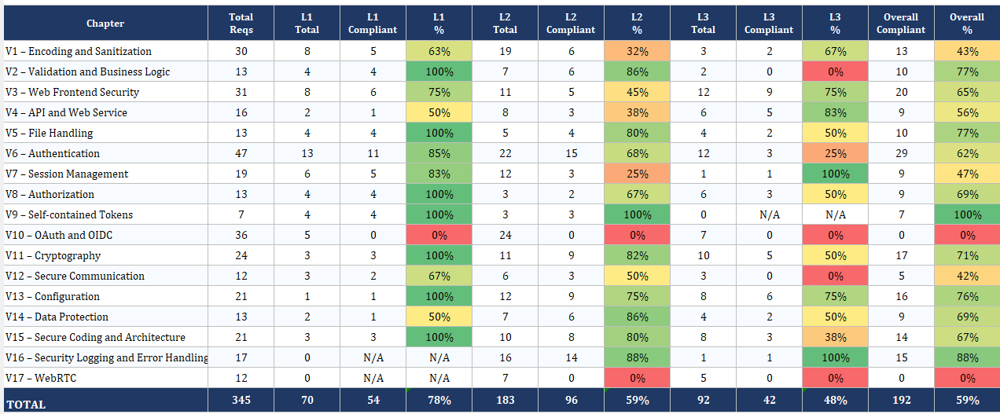
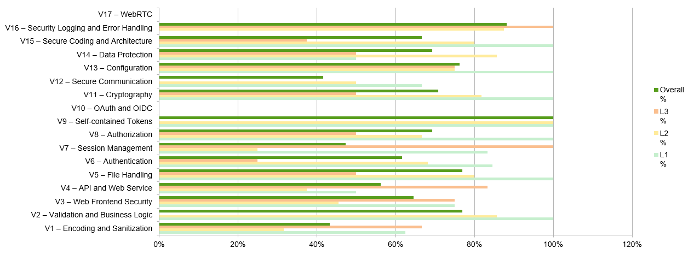

# Evidência ASVS

O tracker ASVS principal do Sprint 2 é o ficheiro Excel:

* [ASVS_5.0_Tracker_Phase_2_Sprint_2.xlsx](ASVS_5.0_Tracker_Phase_2_Sprint_2.xlsx)

O ficheiro foi criado como cópia estrutural do tracker ASVS da Phase 2 Sprint 1, mantendo as mesmas folhas, fórmulas, capítulos e formato geral. O conteúdo foi atualizado para refletir a evidência factual do Sprint 2. Este Markdown é apenas o resumo explicativo da evidência; não substitui o XLSX.

## Base factual usada

| Evidencia | Resultado confirmado |
| --- | --- |
| Testes Maven | `299` testes, `0` falhas, `0` erros, `0` skipped. |
| Runtime probes locais | `101` probes, `101` passed, `0` failed, `0` skipped. |
| Spring Security | `6.5.11` via Spring Boot `3.5.15`. |
| SCA CVEs remediados | CVE-2026-40988, CVE-2026-41694, CVE-2026-41003. |
| Suppressions SCA | CVE-2025-15104 e CVE-2025-7962 documentados como nao aplicaveis/falso positivo para os componentes usados. |

## Evidencia visual ASVS

As imagens seguintes são snapshots do tracker ASVS Sprint 2 e ajudam a apresentar rapidamente a distribuição por capítulo, L1, L2, L3 e percentagem global. O XLSX continua a ser a fonte principal.

## Evolução Sprint 1 -> Sprint 2

O XLSX continua a ser a fonte principal para estados, classificações e percentagens. Esta tabela resume apenas as mudanças qualitativas mais relevantes para leitura rápida; não introduz percentagens adicionais fora do tracker.

| Area ASVS | Sprint 1 | Sprint 2 |
| --- | --- | --- |
| Autenticacao e sessoes | Login/JWT base e primeiros controlos de sessao. | MFA obrigatorio para roles internas, revogacao, inactive user checks e MFA de uso unico reforcados. |
| Autorizacao | RBAC por grupos principais. | Matriz por endpoint, testes negativos por role e ownership em casos de analista. |
| Validacao e API | DTOs e Bean Validation base. | Rejeicao adicional de mass assignment, HPP, headers anormais, content type errado e contratos de erro genericos. |
| Ficheiros e backups | Upload seguro e backups/evidence packages iniciais. | Quotas acumuladas, HMAC/manifestos, restore com reautenticacao e minimizacao de paths internos. |
| Browser/frontend | Paginas estaticas funcionais. | CSP reporting, headers modernos, JWT limitado a `sessionStorage` de sessao, ausencia de `localStorage`, DOM clobbering/XSS checks e fallback de browser. |
| Supply chain | Dependency-Check base. | Spring Security actualizado para `6.5.11`, CVEs triados, suppressions justificadas, SBOM CycloneDX separado e Trivy image scan na pipeline. |
| Runtime evidence | Cobertura runtime limitada. | 101 probes IAST-like/runtime, sem falhas ou skipped na validacao local. |
| Fora de ambito | Capitulos nao usados tratados com menor detalhe. | OAuth/OIDC e WebRTC mantidos como `Not Applicable` quando nao fazem parte do produto. |

## Mapa de evidência

| Área ASVS                      | Evidência GhostReport                                                                                                                                                                                                              | Estado                                                                                                     |
| ------------------------------ | ---------------------------------------------------------------------------------------------------------------------------------------------------------------------------------------------------------------------------------- | ---------------------------------------------------------------------------------------------------------- |
| Arquitetura e threat modelling | Relatório Phase 1, DDD, trust boundaries e relatório Sprint 2.                                                                                                                                                                     | Implementado/documentado                                                                                   |
| Autenticação                   | BCrypt, login interno, JWT, bloqueio de utilizadores inativos e logout/revogação.                                                                                                                                                  | Implementado                                                                                               |
| MFA                            | Desafio MFA antes de JWT para `ADMIN`, `ANALYST` e `AUDITOR`, uso único, TTL e bloqueio do challenge após tentativas inválidas.                                                                                                    | Implementado; canal real de produção fica como controlo operacional futuro                                 |
| Autorização                    | Regras de rota em `SecurityConfig`, RBAC e ownership nos serviços.                                                                                                                                                                 | Implementado                                                                                               |
| Denunciante anónimo/tracking   | Sem conta de reporter; tracking code controla verificação/listagem/download.                                                                                                                                                       | Implementado                                                                                               |
| Validação                      | DTOs, Bean Validation, enums/allowlists, tracking code e contratos API.                                                                                                                                                            | Implementado                                                                                               |
| Ficheiros/uploads              | Extensão/MIME/magic bytes, tamanho, quota por request/denúncia, nomes gerados, path checks e ZIP Slip em backups/packages.                                                                                                         | Implementado                                                                                               |
| Erros e logging                | Erros genéricos, correlation id, audit logs, security alerts e sanitização.                                                                                                                                                        | Implementado                                                                                               |
| Backups/evidência              | ZIPs com hashes, HMAC, manifesto, verificação e restore para staging com reautenticação do admin.                                                                                                                                  | Implementado                                                                                               |
| SCA/SAST/DAST/runtime          | Dependency-Check, CycloneDX, Trivy image scan, CodeQL, SpotBugs, SonarCloud, Gitleaks, ZAP baseline e runtime evidence.                                                                                                                              | Implementado como evidência                                                                                |
| Configuração                   | Secrets por ambiente, PostgreSQL fora de testes, validação de configuração e guia seguro.                                                                                                                                          | Implementado/documentado                                                                                   |
| Headers/browser security       | CSP restritiva com `report-to`, header `Report-To`, endpoint `/security/csp-report`, HSTS preload, COOP/COEP/CORP, Fetch Metadata/Origin validation, fallback para browsers sem features esperadas e bloqueio de headers anormais. | Implementado                                                                                               |
| Criptografia                   | [CRYPTOGRAPHIC_INVENTORY.md](CRYPTOGRAPHIC_INVENTORY.md) mapeia BCrypt, SecureRandom, HMAC-SHA-256, SHA-256, JWT, backups e hashes de integridade; `CryptographicInventoryTest` verifica o inventário.                             | Implementado                                                                                               |
| Dangerous functionality        | [DANGEROUS_FUNCTIONALITY.md](DANGEROUS_FUNCTIONALITY.md) mapeia restore, backups, uploads, packages, password reset, JWT/logging/crypto e tem verificação por teste.                                                               | Implementado                                                                                               |
| Comunicação segura             | Perfil prod-like com modo TLS explícito, TLS 1.2/1.3, cifras modernas e PostgreSQL com `sslmode=verify-ca`/`verify-full`.                                                                                                          | Implementado/configurado; certificado público operacional fica fora do ambiente académico                  |
| L2 aplicável                   | Rate limit de submissão de denúncias, malware scanner local, JWT audience, MFA one-time, no-store, resource limits e logging estruturado.                                                                                          | Reavaliado no XLSX, com controlos parciais mantidos como `In Progress` quando dependem de operação externa |

## Melhorias de código após revisão L1/L2

* `MfaChallengeService` passou a invalidar desafios MFA após o limite configurado de códigos inválidos, com o evento `MFA_VERIFY_LOCKED`.
* `PasswordPolicyService` passou a alinhar com ASVS V6.2.5: aceita qualquer composição de caracteres e mantém comprimento, lista de passwords comprometidas, reutilização e palavras contextuais no serviço.
* `SecurityConfig` passou a aplicar `Cache-Control: no-store, no-cache`, `Pragma: no-cache` e `Expires` a respostas sensíveis de auth, reports, admin, analyst e audit.
* `SecurityConfig` passou a aplicar CSP mais restritiva, HSTS com preload, COOP/COEP/CORP, validação Fetch Metadata/Origin para pedidos unsafe e rejeição antecipada de `TRACE`, headers com caracteres de controlo e `Authorization` excessivamente grande.
* `SecurityConfigurationValidator` passou a validar configuração prod-like de TLS, reverse proxy, PostgreSQL com validação de certificado e limites positivos de pool/conexões/threads.
* `RateLimiterService` passou a ter limite específico para `POST /reports`, reduzindo o abuso automatizado da submissão pública anónima.
* `ReportService` passou a aplicar quota acumulada de anexos por denúncia, além do limite de ficheiros por pedido.
* `SecurityConfig` passou a rejeitar parâmetros escalares duplicados fora de multipart, mitigando HTTP Parameter Pollution antes dos controllers.
* `SecurityConfig` passou a rejeitar pedidos HTTP/2 ou HTTP/3 com headers connection-specific (`Transfer-Encoding`, `Connection`, `Upgrade`, `Keep-Alive` ou `Proxy-Connection`) antes dos controllers.
* As páginas estáticas passaram a carregar `/js/security-support.js`, que deteta browsers sem features de segurança/runtime esperadas, mostra aviso e desativa controlos interativos.
* `TrackingCodeTest` passou a validar 2.000 tracking codes gerados por `SecureRandom` sem colisões em carga académica moderada.
* `SecurityConfig` passou a bloquear explicitamente paths `/.git` e `/.svn` com resposta controlada, reforçando a proteção contra a exposição de metadados de controlo de versão.
* `CRYPTOGRAPHIC_INVENTORY.md` e `CryptographicInventoryTest` passaram a manter evidência de inventário criptográfico e deteção estática de usos esperados de criptografia no código.
* `AdminController` passou a disponibilizar `POST /admin/users/{id}/password-reset`, permitindo ao admin iniciar o reset de password sem escolher nem conhecer a nova password.
* `FrontendXssDataExposureTest` passou a cobrir padrões de DOM clobbering, garantindo a ausência de `name` em controlos e de acesso `document.<id>` aos elementos da página.
* `AdminBackupController` passou a exigir reautenticação por `X-Reauth-Password` antes de executar restore de backup para staging.
* `BackupRestoreResponse` e `CasePackageResponse` deixaram de expor paths internos/listas de ficheiros gerados, com cobertura em `ResponseDataMinimizationTest`.
* `DANGEROUS_FUNCTIONALITY.md` e `DangerousFunctionalityInventoryTest` passaram a manter rastreabilidade de operações sensíveis.

## Melhorias L2 adicionais

O tracker XLSX foi revisto para todos os capítulos L2. Foram atualizados como `Compliant` apenas controlos com evidência verificável no código, testes ou documentação: business limits, malware scanner local/EICAR, password policy, MFA one-time/hashed challenge, JWT `iss`/`aud`/`jti`, crypto key rotation hooks, no-store em dados sensíveis, limites de recursos, configuração prod-like, logging estruturado e tratamento de erros inesperados.

## Melhorias L3 adicionais

O tracker XLSX também foi revisto para controlos L3 que já tinham evidência real ou que puderam ser reforçados sem alterar radicalmente a aplicação:

* `V3.4.7` passou a `Compliant` com CSP `report-to csp-endpoint`, header `Report-To`, endpoint público para relatórios CSP, alerta `CSP_VIOLATION` e sanitização de JWT/tracking codes antes de persistir o alerta.
* `V3.1.1` e `V3.7.4` foram atualizados com base nos headers já testados: CSP, HSTS `includeSubDomains`/`preload`, COOP, CORP, COEP, Permissions-Policy e no-store para respostas sensíveis.
* `V8.3.2` foi atualizado porque a validação JWT consulta o estado atual do utilizador e rejeita imediatamente users desativados.
* `V11.2.4` foi atualizado porque `JwtService` valida HMAC SHA-256 com comparação constante via `MessageDigest.isEqual`.
* `V13.4.7` foi atualizado porque os uploads ficam fora dos recursos estáticos e o web tier permite apenas páginas públicas explícitas, `/css/**` e `/js/**`.
* `V14.2.5` foi atualizado pela cobertura `no-store/no-cache` em respostas sensíveis de auth, reports, admin, analyst, audit e security.
* `V1.2.10` foi reclassificado como `Not Applicable`, porque não existe exportação CSV/XLSX/ODS no GhostReport atual.
* `V5.2.4` passou a `Compliant` com limite de tamanho, limite por request e quota acumulada por denúncia.
* `V11.3.1`, `V11.3.2` e `V11.5.2` foram atualizados com evidência de algoritmos aprovados, ausência de ECB/PKCS#1 v1.5 e teste de `SecureRandom` sob carga moderada.
* `V15.3.7` passou a `Compliant` com rejeição explícita de HTTP Parameter Pollution por parâmetros escalares duplicados.
* `V6.3.2` e `V7.4.2` foram corrigidos com base em seed users desativados em prod-like e rejeição de JWTs quando a conta interna fica inativa.
* `V1.5.3` passou a `Compliant` com uso consistente de parsers/APIs estruturadas: Jackson/Bean Validation nos DTOs, helpers DOM por text node, normalização de paths/URIs e ausência de parsing de tracking code via query string no browser.
* `V3.7.5` passou a `Compliant` com fallback documentado para browsers sem `fetch`, `Promise`, `crypto.getRandomValues`, `TextEncoder` ou APIs DOM esperadas.
* `V4.2.3` passou a `Compliant` com rejeição de headers connection-specific em pedidos HTTP/2 e HTTP/3.
* `V6.2.5` passou a `Compliant` porque a aplicação deixou de exigir classes específicas de caracteres nas passwords.
* `V13.4.1` passou a `Compliant` com bloqueio explícito de `/.git` e `/.svn`.
* `V11.1.1`, `V11.1.3` e `V11.1.4` passaram a `Compliant` com inventário criptográfico documentado, política de alteração e teste estático que garante que os mecanismos criptográficos principais continuam mapeados.
* `V6.4.6` passou a `Compliant` porque os admins podem iniciar o reset de password sem definir a password do utilizador.
* `V3.2.3` passou a `Compliant` com teste automático contra padrões de DOM clobbering no frontend estático.
* `V7.5.3` passou a `Compliant` porque as operações sensíveis cobertas exigem verificação adicional: password atual em password change e `X-Reauth-Password` em restore de backup admin.
* `V14.2.6` passou a `Compliant` porque as respostas de backup/package deixaram de expor paths internos ou listas de ficheiros gerados, com teste de contrato.
* `V15.1.5` passou a `Compliant` com inventário de dangerous functionality verificado por teste.
* `V11.3.4` e `V11.3.5` foram reclassificados como `Not Applicable` porque a aplicação não usa `Cipher`/encriptação aplicacional com IV ou composição encryption+MAC.

Capítulos fora do escopo implementado, como OAuth/OIDC e WebRTC, permanecem `Not Applicable`; não foram convertidos em `Compliant` para evitar claims enganosos.

## Limitações ASVS registadas

* Não existe agente IAST real; a evidência é runtime security evidence / IAST-like academic evidence.
* ZAP é baseline/passivo e não cobre contexto autenticado completo.
* MFA em dev/test pode expor código em log para demonstração; a produção precisa de um canal real.
* Rate limiting é em memória.
* Secret manager, SIEM/WORM, certificado público/TLS operacional, KMS e Flyway/Liquibase ficam como controlos futuros/operacionais.

## Documentos relacionados

* [PHASE2_SPRINT2_REPORT.md](PHASE2_SPRINT2_REPORT.md)
* [AUTHORIZATION_MATRIX.md](AUTHORIZATION_MATRIX.md)
* [SECURITY_TESTING.md](SECURITY_TESTING.md)
* [DEVSECOPS_PIPELINE.md](DEVSECOPS_PIPELINE.md)
* [SCA_TRIAGE.md](SCA_TRIAGE.md)
* [CRYPTOGRAPHIC_INVENTORY.md](CRYPTOGRAPHIC_INVENTORY.md)
* [DANGEROUS_FUNCTIONALITY.md](DANGEROUS_FUNCTIONALITY.md)
* [IAST_RUNTIME_SECURITY.md](IAST_RUNTIME_SECURITY.md)
* [SECURITY_ASSESSMENT.md](SECURITY_ASSESSMENT.md)
