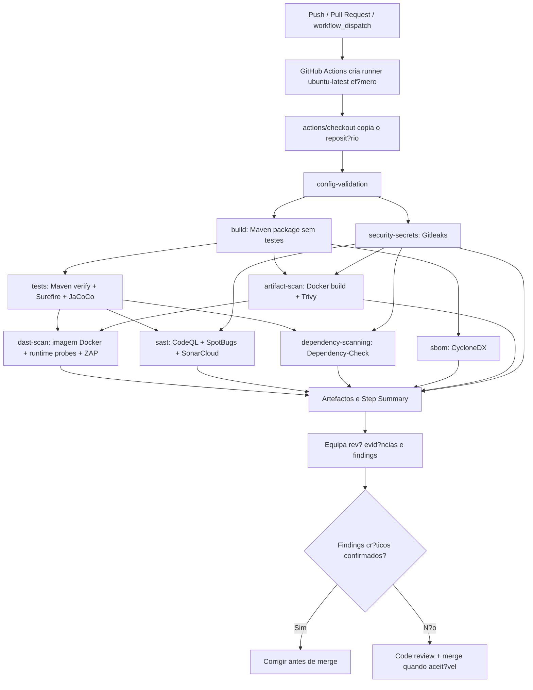
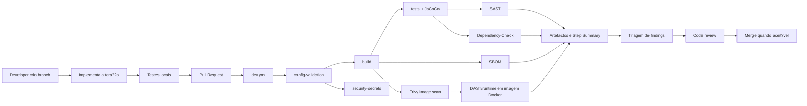

# Pipeline DevSecOps e automações

## 1. Objetivo

A pipeline DevSecOps do GhostReport transforma a entrega num processo reprodutível: compila, testa, mede cobertura, procura secrets, analisa código, verifica dependências, gera SBOM, arranca a aplicação, executa checks runtime, corre ZAP baseline e publica artefactos.

## 2. Workflows existentes

| Workflow                    | Triggers                                                                                                                                                                                      | Objetivo                                         |
| --------------------------- | --------------------------------------------------------------------------------------------------------------------------------------------------------------------------------------------- | ------------------------------------------------ |
| `.github/workflows/dev.yml` | `push` para `main`/`develop`, `pull_request` para `main`/`develop`, `workflow_dispatch`                                                                                                       | Pipeline principal de build, testes e segurança. |
| `.github/workflows/pit.yml` | `workflow_dispatch`, PRs para `main` quando mudam `ghostreport/pom.xml`, `ghostreport/src/main/**`, `ghostreport/src/test/**` ou o próprio workflow, e `push` para `main` com os mesmos paths | Mutation testing completo com PIT.               |

O workflow principal usa `concurrency` para cancelar execuções anteriores da mesma ref, evitando consumir runner em builds obsoletas.

`.github/dependabot.yml` também existe, mas não é um workflow de CI. Ele abre atualizações semanais para Maven e GitHub Actions; esses PRs disparam os workflows acima de acordo com os seus triggers e paths.

## 3. Como o GitHub Actions executa os jobs

Os workflows reais do reposit?rio usam GitHub-hosted runners. Todos os jobs em `.github/workflows/dev.yml` e `.github/workflows/pit.yml` declaram `runs-on: ubuntu-latest`; n?o h? `self-hosted` runner configurado. Cada job corre numa VM Linux ef?mera criada pelo GitHub para aquela execu??o e descartada no fim do job.

Consequ?ncias pr?ticas:

* cada job arranca isolado, mesmo quando pertence ao mesmo workflow;
* os ficheiros criados em `ghostreport/target` existem apenas na c?pia tempor?ria do runner;
* os jobs n?o partilham ficheiros automaticamente entre si;
* ficheiros que precisam sobreviver ao job devem ser publicados como artefactos com `actions/upload-artifact`;
* a imagem Docker usada pelo DAST ? transferida entre jobs como artefacto (`ghostreport-docker-image`), porque a VM do job `artifact-scan` ? descartada no fim;
* depend?ncias podem ser aceleradas por cache, mas a cache n?o ? evid?ncia e n?o deve guardar secrets.

O primeiro passo t?cnico relevante de cada job ? o checkout: `actions/checkout@v6` copia o reposit?rio para o workspace tempor?rio do runner. Nos jobs Maven, `actions/setup-java@v5` configura Temurin Java 17 com cache Maven, alinhado com `<java.version>17</java.version>` no `pom.xml`. O Maven Wrapper do projeto aponta para Maven `3.9.14`, por isso `./mvnw` garante uma vers?o Maven consistente no runner.

Servi?os auxiliares tamb?m vivem apenas durante o job. O job `tests` e o job `dast-scan` criam um servi?o `postgres:16` associado ao job, exposto em `localhost:5432`, com base de dados `ghostreport`, utilizador `postgres` e password de teste `user`. Este PostgreSQL ? usado por testes e runtime scan, e os dados desaparecem quando o job termina. Os jobs `config-validation`, `build`, `security-secrets`, `sast`, `dependency-scanning`, `sbom`, `artifact-scan` e `pit` n?o declaram servi?o de base de dados.

O job `artifact-scan` usa o Dockerfile real do projeto para construir `ghostreport:ci`, corre Trivy contra essa imagem e s? exporta a imagem para o DAST se o gate cr?tico passar. O job `dast-scan` descarrega esse artefacto, faz `docker load` e arranca a aplica??o em container com o perfil `dev`, ligada ao PostgreSQL ef?mero do pr?prio job. Assim, o ZAP e os probes runtime exercitam a imagem final validada pelo scan de container, n?o apenas um JAR arrancado localmente.

## 4. Fluxo completo developer -> merge

O fluxo esperado da equipa ?:

1. O developer cria uma branch curta a partir de `main` ou `develop`.
2. Implementa a altera??o e atualiza os testes/documenta??o quando o claim de seguran?a muda.
3. Corre localmente os testes relevantes; para o backend, o m?nimo ? `cd ghostreport; .\mvnw.cmd test`.
4. Abre uma pull request para `main` ou `develop`.
5. O workflow `dev.yml` arranca automaticamente para a pull request.
6. `config-validation` confirma ficheiros essenciais, Java 17 e Dockerfile Temurin 17.
7. `build` compila e empacota a aplica??o sem testes, publicando o JAR.
8. `tests` executa `./mvnw verify`, testes automatizados e JaCoCo com PostgreSQL ef?mero.
9. `security-secrets` executa Gitleaks contra o reposit?rio.
10. `sast` compila, corre SpotBugs, CodeQL e SonarCloud quando o `SONAR_TOKEN` est? configurado.
11. `dependency-scanning` executa OWASP Dependency-Check com gate para CVSS >= 9 n?o suprimido.
12. `sbom` gera `bom.json` e `bom.xml` com CycloneDX.
13. `artifact-scan` constr?i a imagem Docker, corre Trivy e bloqueia findings `CRITICAL` corrig?veis/n?o suprimidos.
14. `dast-scan` arranca a imagem Docker validada, executa testes runtime, probes HTTP, verifica??o de logs e ZAP baseline.
15. Os artefactos e o GitHub Step Summary ficam dispon?veis para revis?o.
16. A equipa avalia os findings: confirmar, corrigir, justificar falso positivo ou documentar limita??o.
17. Findings cr?ticos confirmados bloqueiam o merge at? ? corre??o.
18. Findings informativos ou fora do ?mbito podem ser aceites com justifica??o em triagem/documenta??o.
19. S? depois da revis?o humana e de checks aceit?veis o PR deve ser merged.

**Vis?o r?pida do mesmo fluxo:**

## 5. Quando corre e em que branches

| Evento                                | Branches/paths                             | Resultado esperado                                       |
| ------------------------------------- | ------------------------------------------ | -------------------------------------------------------- |
| Pull request para `main` ou `develop` | Qualquer alteração coberta pelo PR         | Executa a pipeline principal antes do merge.             |
| Push para `main` ou `develop`         | Commits diretos ou merges                  | Revalida a branch integrada.                             |
| `workflow_dispatch`                   | Manual                                     | Permite repetir a evidência ou validar a entrega.        |
| PIT PR/push                           | Apenas paths Java/Maven/workflow em `main` | Mutation testing quando altera código/testes relevantes. |

Branches de documentação continuam a disparar `dev.yml` quando abrem PR para as branches alvo, mas o PIT só corre se os paths configurados forem alterados.

## 6. Checks bloqueantes e findings aceit?veis

| ?rea | Modo no reposit?rio | Decis?o de merge |
| --- | --- | --- |
| `config-validation` | Verifica ficheiros essenciais, Java 17 no `pom.xml` e Temurin 17 no Dockerfile. | Bloqueante quando falta configura??o essencial ou h? desalinhamento de runtime. |
| `build` | `./mvnw -DskipTests clean package`. | Bloqueante para falhas de compila??o/empacotamento. |
| `tests` | `./mvnw verify`, Surefire e JaCoCo com PostgreSQL ef?mero. | Bloqueante para falhas de testes ou coverage. |
| Gitleaks | Job termina com o exit code da ferramenta e relat?rio redigido. | Bloqueante para leaks confirmados; falsos positivos exigem justifica??o/configura??o. |
| SonarCloud | Falha se `SONAR_TOKEN` estiver ausente ou se a an?lise falhar. | Bloqueante no estado atual do workflow; aus?ncia de token ? limita??o operacional. |
| CodeQL | `init` antes de SonarCloud e `analyze` depois. | Findings altos/cr?ticos confirmados devem ser corrigidos antes do merge. |
| SpotBugs | Gera evid?ncia SAST no job `sast`. | Falha t?cnica bloqueia o job; findings s?o triados em `SPOTBUGS_TRIAGE.md`. |
| Dependency-Check | `failBuildOnCVSS=9` sem `continue-on-error`. | Bloqueante para CVEs n?o suprimidos com CVSS >= 9; High fica em triagem/evid?ncia. |
| CycloneDX SBOM | Job pr?prio `sbom` gera `bom.json`/`bom.xml`. | Bloqueante para falha t?cnica de gera??o da SBOM. |
| Trivy image scan | Scan HIGH/CRITICAL da imagem Docker; gate separado para CRITICAL corrig?vel/n?o suprimido. | Bloqueante para CRITICAL; HIGH fica em evid?ncia porque pode quebrar a pipeline por base image transit?ria. |
| Runtime tests no `dast-scan` | Testes Maven selecionados antes do scan live. | Bloqueante para controlos runtime. |
| ZAP baseline | `continue-on-error` com `-I`. | Evid?ncia/review; findings s?o triados, n?o bloqueiam automaticamente. |
| PIT | Workflow separado sem `continue-on-error`. | Bloqueia a pr?pria run quando acionado; n?o substitui o gate r?pido de PR do `dev.yml`. |

O reposit?rio n?o cont?m configura??o de branch protection. Portanto, a partir dos ficheiros s? ? poss?vel afirmar quais os jobs que falham tecnicamente; se esses checks bloqueiam automaticamente o merge depende da configura??o do GitHub no reposit?rio remoto.

**Interpreta??o pr?tica:**

* falha de compila??o, testes, coverage, config-validation, secrets confirmados, CVE cr?tico SCA ou CVE cr?tico de imagem impede o merge;
* CVE explor?vel numa depend?ncia utilizada deve ser corrigido antes de aceitar o PR, mesmo quando a severidade for High;
* CVE n?o aplic?vel, falso positivo SAST, High de imagem ainda n?o corrig?vel ou alerta ZAP informativo pode ser aceite com justifica??o e liga??o para a evid?ncia;
* aus?ncia de secret operacional, como `SONAR_TOKEN`, deve ser tratada como limita??o de ambiente, e n?o como claim de seguran?a implementado.

## 7. Job `config-validation`

**Ambiente t?cnico:**

* workflow: `.github/workflows/dev.yml`;
* runner: `ubuntu-latest`;
* timeout: 10 minutos;
* working directory dos comandos: `./ghostreport`;
* n?o usa Java nem base de dados.

**Execu??o interna:**

* confirma a exist?ncia de `pom.xml`, `Dockerfile`, `.dockerignore`, `application.yaml`, `.gitleaks.toml`, workflows e script runtime probe;
* valida que o `pom.xml` declara Java 17;
* valida que o Dockerfile usa imagens `eclipse-temurin:17-jdk`/`17-jre`;
* publica sum?rio no GitHub Step Summary.

**Gate:** bloqueante apenas para aus?ncia de ficheiros essenciais ou desalinhamento ?bvio da vers?o Java/base image.

## 8. Job `build`

**Ambiente t?cnico:**

* workflow: `.github/workflows/dev.yml`;
* runner: `ubuntu-latest`;
* timeout: 20 minutos;
* depende de `config-validation`;
* working directory dos comandos: `./ghostreport`;
* Java: Temurin 17 com cache Maven.

**Execu??o interna:**

* checkout;
* configura??o Java 17 com cache Maven;
* `./mvnw -DskipTests clean package`;
* upload do artefacto `ghostreport-application-jar`;
* publica??o de sum?rio no GitHub Step Summary.

**Valor de seguran?a:** separa a compila??o/empacotamento do gate de testes, tornando a pipeline mais leg?vel e permitindo reutilizar o artefacto como evid?ncia de build.

**Gate:** bloqueante para falha de compila??o ou empacotamento.

## 9. Job `tests`

**Ambiente t?cnico:**

* workflow: `.github/workflows/dev.yml`;
* runner: `ubuntu-latest`;
* timeout: 35 minutos;
* depende de `config-validation` e `build`;
* servi?o auxiliar: container `postgres:16` em `localhost:5432`;
* Java: Temurin 17 com cache Maven.

**Execu??o interna:**

* `./mvnw verify` com `DB_URL`, `DB_USERNAME` e `DB_PASSWORD` apontados para PostgreSQL ef?mero;
* upload de Surefire reports;
* upload de JaCoCo;
* publica??o de sum?rio no GitHub Step Summary.

**Valor de seguran?a:** impede regress?o funcional, executa testes de seguran?a no gate normal e publica evid?ncia de cobertura.

**Gate:** bloqueante para testes, coverage e falhas t?cnicas do Maven verify.

## 10. Job `security-secrets`

**Ambiente t?cnico:**

* workflow: `.github/workflows/dev.yml`;
* runner: `ubuntu-latest`;
* timeout: 10 minutos;
* depende de `config-validation`;
* working directory dos comandos: `./ghostreport`;
* n?o configura Java porque a ferramenta corre em Docker;
* n?o usa servi?o de base de dados.

**Execu??o interna:**

* corre Gitleaks em Docker;
* usa `.gitleaks.toml`;
* gera `target/gitleaks/gitleaks-report.json`;
* publica o artefacto `secret-scan-gitleaks-json`;
* escreve um sum?rio da evid?ncia.

**Mitiga??o STRIDE:** reduz Information Disclosure por secrets commitados e ajuda a detetar tokens/passwords/keys antes do merge.

**Gate:** bloqueante para leaks confirmados, porque o script termina com o exit code do Gitleaks. O relat?rio ? redigido com `--redact`.

## 11. Job `sast`

**Ambiente t?cnico:**

* workflow: `.github/workflows/dev.yml`;
* runner: `ubuntu-latest`;
* timeout: 30 minutos;
* depende de `tests` e `security-secrets`;
* working directory dos comandos: `./ghostreport`;
* Java: Temurin 17 com cache Maven;
* cache adicional: `~/.sonar/cache` com `actions/cache@v5`;
* permissions incluem `security-events: write` para CodeQL/Code Scanning.

**Execu??o interna:**

* inicializa o CodeQL para Java;
* compila o projeto para an?lise;
* corre SpotBugs;
* corre SonarCloud usando `SONAR_TOKEN` e vari?veis de projeto/organiza??o quando configuradas;
* executa o CodeQL analyze;
* publica `sast-reports`.

**Notas importantes:**

* o CodeQL envia resultados para o GitHub Code Scanning;
* o SpotBugs gera XML/site como evid?ncia;
* o SonarCloud depende do secret `SONAR_TOKEN`;
* se `SONAR_TOKEN` estiver ausente, o script escreve `target/sast-evidence/sonarcloud-summary.txt` e falha o job antes do passo `Run CodeQL analysis`;
* SAST ? evid?ncia complementar, n?o prova a aus?ncia de vulnerabilidades.

**Gate:** bloqueante para falhas t?cnicas do job SAST. Findings SAST confirmados de severidade alta/cr?tica devem ser corrigidos antes do merge.

## 12. Job `dependency-scanning`

**Ambiente t?cnico:**

* workflow: `.github/workflows/dev.yml`;
* runner: `ubuntu-latest`;
* timeout: 25 minutos;
* depende de `tests` e `security-secrets`;
* working directory dos comandos: `./ghostreport`;
* Java: Temurin 17 com cache Maven;
* sem servi?o de base de dados;
* permissions incluem `security-events: write` para upload SARIF.

**Execu??o interna:**

* OWASP Dependency-Check `12.1.0`;
* formatos HTML/XML/JSON/SARIF;
* `failBuildOnCVSS=9`, para criar um gate real de Critical;
* upload SARIF para GitHub Code Scanning quando gerado;
* artefacto `dependency-check-sca-reports`;
* sum?rio no Step Summary.

**Evid?ncia recente:**

* os alertas do Spring Security `6.5.10` foram corrigidos;
* o Spring Boot BOM `3.5.15` resolve o Spring Security `6.5.11`;
* as suppressions documentadas continuam limitadas a falso positivo/componente n?o usado.

**Gate:** bloqueante para vulnerabilidades n?o suprimidas com CVSS >= 9. O n?vel High n?o ? automaticamente bloqueante para reduzir falsos positivos, mas continua sujeito a triagem em `SCA_TRIAGE.md`.

## 13. Job `sbom`

**Ambiente t?cnico:**

* workflow: `.github/workflows/dev.yml`;
* runner: `ubuntu-latest`;
* timeout: 15 minutos;
* depende de `build`;
* Java: Temurin 17 com cache Maven.

**Execu??o interna:**

* executa CycloneDX `makeAggregateBom`;
* gera `target/bom.json` e `target/bom.xml`;
* publica o artefacto `sbom-cyclonedx`;
* escreve sum?rio no Step Summary.

**Gate:** bloqueante para falha t?cnica de gera??o da SBOM.

## 14. Job `artifact-scan`

**Ambiente t?cnico:**

* workflow: `.github/workflows/dev.yml`;
* runner: `ubuntu-latest`;
* timeout: 30 minutos;
* depende de `build` e `security-secrets`;
* requer Docker dispon?vel no GitHub-hosted runner.

**Execu??o interna:**

* constr?i `ghostreport:ci` a partir de `ghostreport/Dockerfile`;
* corre Trivy contra a imagem para gerar relat?rio JSON e tabela para severidades HIGH/CRITICAL;
* aplica gate separado para vulnerabilidades CRITICAL corrig?veis/n?o suprimidas;
* exporta a imagem como `target/ghostreport-image.tar` para o job `dast-scan`;
* publica `container-trivy-scan-reports` e `ghostreport-docker-image`.

**Gate:** bloqueante para CRITICAL. O pedido original considerava HIGH/CRITICAL, mas a op??o implementada ? mais equilibrada: HIGH fica em evid?ncia/triagem para evitar pipeline inst?vel por findings transit?rios de base image, sem deixar de bloquear risco cr?tico.

## 15. Job `dast-scan`

**Ambiente t?cnico:**

* workflow: `.github/workflows/dev.yml`;
* runner: `ubuntu-latest`;
* timeout: 35 minutos;
* depende de `tests`, `security-secrets` e `artifact-scan`;
* servi?o auxiliar: container `postgres:16` em `localhost:5432`;
* Java: Temurin 17 com cache Maven para os testes runtime selecionados;
* runtime: imagem Docker `ghostreport:ci`, carregada a partir do artefacto produzido por `artifact-scan`;
* OWASP ZAP corre em container Docker com `--network host`.

**Execu??o interna:**

* corre testes runtime de seguran?a selecionados;
* descarrega e carrega a imagem Docker validada pelo Trivy;
* arranca o GhostReport em `localhost:8081` com perfil `dev` e PostgreSQL ef?mero;
* envia logs do container para `target/ghostreport-dast-app.log`;
* espera pela readiness;
* exercita p?ginas p?blicas, reports, tracking code, uploads, download/listagem de anexos, login/MFA/logout/password reset, endpoints admin, analyst e auditor, JWT inv?lido, Authorization malformado e outros casos negativos;
* verifica os logs para fuga de dados sens?veis;
* corre OWASP ZAP baseline;
* prepara o sum?rio IAST-like/runtime;
* publica `iast-runtime-security-evidence`;
* publica `dast-zap-baseline-reports`;
* remove o container no fim.

O ZAP baseline ? evid?ncia passiva/n?o autenticada. A parte runtime cobre mais do que o ZAP sozinho, porque combina testes, aplica??o real em container, HTTP probes e logs.

**Valida??o local expandida do probe em 2026-06-15:**

| M?trica | Valor |
| --- | --- |
| Total de probes | 101 |
| Passed | 101 |
| Failed | 0 |
| Skipped | 0 |
| Public endpoint probes | 23 |
| Admin endpoint probes | 22 |
| Analyst endpoint probes | 17 |
| Auditor endpoint probes | 13 |
| Negative-case probes | 6 |

N?o houve probes skipped na valida??o local. `GET /login.html` ? tratado como controlo de exposi??o quando responde `401/404`, e o restore destrutivo de backup continua fora do probe runtime porque exige reautentica??o e ? coberto por testes automatizados. O workflow publica o JSON `runtime-probe-summary.json` para confirmar estes n?meros em cada run.

**Artefactos documentados na entrega:**

* [iast-runtime-evidence.md](iast-runtime-evidence.md)
* [runtime-endpoints.md](runtime-endpoints.md)
* [runtime-log-sanitization.md](runtime-log-sanitization.md)

**Gate:** os testes runtime, o carregamento/arranque da imagem Docker, a readiness e os probes runtime s?o bloqueantes. O passo ZAP usa `continue-on-error: true` e `-I`, por isso funciona como evid?ncia DAST baseline/passiva; os findings do ZAP precisam de triagem humana.

## 16. Workflow `pit-mutation-testing`

**Ambiente técnico:**

* workflow: `.github/workflows/pit.yml`;
* job: `pit`;
* runner: `ubuntu-latest`;
* timeout: 90 minutos;
* triggers: `workflow_dispatch`, PRs para `main` e pushes para `main` quando mudam `ghostreport/pom.xml`, `ghostreport/src/main/**`, `ghostreport/src/test/**` ou `.github/workflows/pit.yml`;
* working directory dos comandos: `./ghostreport`;
* Java: Temurin 17 com cache Maven;
* sem serviço de base de dados.

**Execução interna:**

* prepara Java 17 e cache Maven;
* compila os testes;
* inventaria as classes alvo;
* executa o PIT com a configuração do `pom.xml`;
* valida a existência de `target/pit-reports/index.html`;
* gera um sumário em Markdown;
* publica `pit-mutation-testing-report`.

O PIT fica separado porque é mais lento. Serve para avaliar a qualidade dos testes e não para bloquear rapidamente todos os commits.

**Gate:** sem `continue-on-error`; falha se não encontrar classes alvo, se o PIT falhar ou se `target/pit-reports/index.html` não for gerado. O artefacto usa `if-no-files-found: error`.

## 17. Artefactos esperados

Artefactos de GitHub Actions são ficheiros copiados do runner para o run do workflow, para revisão posterior. Eles são diferentes dos ficheiros temporários do workspace: sem upload por `actions/upload-artifact`, os relatórios gerados no runner desaparecem quando a VM efémera é descartada.

| Artefacto | Origem | Uso |
| --- | --- | --- |
| `ghostreport-application-jar` | `build` | JAR empacotado como evid?ncia de build. |
| `ci-surefire-test-reports` | `tests` | Evid?ncia de testes. |
| `ci-jacoco-coverage-report` | `tests` | Cobertura. |
| `secret-scan-gitleaks-json` | `security-secrets` | Secrets scan. |
| `sast-reports` | `sast` | SpotBugs/SonarCloud notes. |
| GitHub Code Scanning alerts | CodeQL e Dependency-Check SARIF | Findings centralizados. |
| `dependency-check-sca-reports` | `dependency-scanning` | SCA HTML/XML/JSON/SARIF. |
| `sbom-cyclonedx` | `sbom` | SBOM JSON/XML. |
| `container-trivy-scan-reports` | `artifact-scan` | Trivy image scan JSON/tabela e gate cr?tico. |
| `ghostreport-docker-image` | `artifact-scan` | Imagem Docker usada pelo `dast-scan`. |
| `iast-runtime-security-evidence` | `dast-scan` | Runtime/IAST-like. |
| `dast-zap-baseline-reports` | `dast-scan` | ZAP HTML/XML/JSON e logs. |
| `pit-mutation-testing-report` | `pit.yml` | Mutation testing. |

A maioria dos artefactos segue a reten??o por defeito do GitHub/reposit?rio/organiza??o. A imagem Docker `ghostreport-docker-image` usa `retention-days: 1`, porque serve apenas para transferir a imagem validada para o job `dast-scan` dentro da mesma evid?ncia de CI. N?o se deve assumir que os artefactos ficam guardados para sempre.

Os artefactos temporários gerados em `target/` não devem ser commitados no repositório; a documentação da entrega referencia o tipo de evidência e, quando útil, inclui resumos em Markdown.

## 18. Cache, artefactos, secrets e vari?veis

A cache e os artefactos não resolvem o mesmo problema:

* a cache Maven (`actions/setup-java` com `cache: maven`) acelera as builds ao reaproveitar dependências descarregadas;
* a cache Sonar (`actions/cache` em `~/.sonar/cache`) acelera o job `sast`;
* os artefactos guardam evidências como Surefire, JaCoCo, Dependency-Check, SBOM, Trivy, SpotBugs, ZAP, logs runtime e PIT;
* nenhum deles deve ser usado para guardar secrets.

**Secrets e variáveis vistos nos workflows:**

| Nome                                                | Tipo                         | Onde aparece              | Uso                                                         |
| --------------------------------------------------- | ---------------------------- | ------------------------- | ----------------------------------------------------------- |
| `SONAR_TOKEN`                                       | GitHub Actions secret        | `sast`                    | Autenticar o SonarCloud.                                    |
| `SONAR_PROJECT_KEY`                                 | GitHub Actions variable      | `sast`                    | Project key do SonarCloud, com valor por defeito no script. |
| `SONAR_ORGANIZATION`                                | GitHub Actions variable      | `sast`                    | Organização do SonarCloud, com valor por defeito no script. |
| `NVD_API_KEY`                                       | GitHub Actions secret        | `dependency-scanning`     | Passado ao Dependency-Check quando configurado.             |
| `DB_URL`, `DB_USERNAME`, `DB_PASSWORD`              | Variáveis de ambiente do job | `tests`, `dast-scan` | Credenciais de teste para o PostgreSQL efémero do job.      |
| `POSTGRES_DB`, `POSTGRES_USER`, `POSTGRES_PASSWORD` | Variáveis do serviço         | `tests`, `dast-scan` | Configuração do container `postgres:16`.                    |

`POSTGRES_PASSWORD: user` e `DB_PASSWORD: user` são credenciais de teste dentro do runner efémero, não GitHub Actions secrets. Os secrets reais são injetados no runner apenas durante o job que os declara e não devem ser impressos nos logs, incluídos na SBOM nem guardados em artefactos. O Gitleaks procura secrets commitados no repositório; isso é diferente de usar secrets de runtime injetados pelo GitHub Actions.

O job `dast-scan` também procura nos logs padrões sensíveis, incluindo nomes como `JWT_SECRET` e `BACKUP_HMAC_SECRET`. Essa verificação indica apenas que o workflow procura fugas desses padrões nos logs; não significa que esses secrets estejam configurados no GitHub Actions.

## 19. Rela??o com STRIDE

| STRIDE                 | Pipeline/automação                                                            |
| ---------------------- | ----------------------------------------------------------------------------- |
| Spoofing               | Testes de auth/JWT/MFA no build; runtime probes em CI.                        |
| Tampering              | Testes de backup/package integrity; SAST; dependency scanning.                |
| Repudiation            | Testes de audit logs; runtime logs arquivados.                                |
| Information Disclosure | Gitleaks, frontend XSS/data exposure tests, log leakage checks, ZAP baseline. |
| Denial of Service      | Rate limiter tests, upload limits, ZAP baseline como sinal passivo.           |
| Elevation of Privilege | RBAC/ownership tests no build; CodeQL/SpotBugs como apoio.                    |

## Code review process

O fluxo de revisão pretendido no GhostReport é branch-based: as alterações são isoladas em branches, revistas por pull request e validadas por workflows antes de serem integradas. A evidência local do repositório confirma merges de PRs, branches `feature/*`, `fix/*`, `docs/*`, `security/*`/`ci-*`, Dependabot e os workflows `dev.yml` e `pit.yml`. A metadata detalhada de aprovações/reviewers deve ser confirmada na interface do GitHub, porque não fica totalmente disponível no clone local.

O code review não é apenas leitura manual. Ele combina revisão humana, testes, análise estática, análise de dependências, runtime evidence, ZAP baseline, artefactos e revisão da documentação.

**Fluxo de revisão:**

1. Criar uma branch curta com âmbito claro.
2. Implementar a alteração mantendo a arquitetura existente.
3. Correr os testes locais relevantes; para o backend, o mínimo recomendado é `cd ghostreport; .\mvnw.cmd test`.
4. Abrir uma pull request com resumo, motivo e impacto de segurança.
5. Validar a run de `dev.yml`: config-validation, build, testes/JaCoCo, Gitleaks, SAST, Dependency-Check, SBOM, Trivy image scan, runtime evidence e ZAP baseline.
6. Executar ou rever `pit.yml` quando a alteração toca em código/testes Java e o custo temporal se justifica.
7. Triar findings: corrigir, aceitar com justificação, suprimir com prazo de revisão ou documentar a limitação.
8. Atualizar os testes, a matriz de autorização, o ASVS ou os anexos quando uma claim de segurança muda.
9. Integrar apenas quando os checks e os riscos confirmados forem aceitáveis.

### Code review responsibilities

| Área revista   | O que é verificado                                                                 | Evidência                                                                 |
| -------------- | ---------------------------------------------------------------------------------- | ------------------------------------------------------------------------- |
| Funcionalidade | A alteração cumpre o objetivo e não quebra fluxos existentes.                      | Testes Maven, runtime probes e revisão manual.                            |
| Segurança      | Autenticação, autorização, validação, logging, uploads, backups, errors e secrets. | Security tests, SAST, DAST/runtime, Gitleaks e `AUTHORIZATION_MATRIX.md`. |
| Dependências   | CVEs, versões vulneráveis, suppressions e SBOM.                                    | Dependency-Check, Dependabot, CycloneDX e `SCA_TRIAGE.md`.                |
| Qualidade      | Code smells, duplicação, complexidade, cobertura e mutações quando aplicável.      | SonarCloud, SpotBugs, JaCoCo e PIT.                                       |
| Documentação   | Claims técnicos alinhados com código, outputs e artefactos.                        | README, relatório principal, ASVS XLSX e anexos.                          |

### Security review checklist

* A alteração muda a autenticação, autorização, roles ou ownership?
* A alteração cria ou altera um endpoint?
* O endpoint foi adicionado a `AUTHORIZATION_MATRIX.md`?
* Existem testes positivos e negativos para as roles relevantes?
* Há validação de input por DTO, Bean Validation, enum ou allowlist?
* Há risco de mass assignment por binding indevido?
* Há risco de path traversal, ZIP Slip ou acesso indevido ao filesystem?
* Há risco de expor passwords, JWTs, tracking codes, MFA codes, secrets, stack traces ou paths internos?
* A alteração afeta uploads, backups, evidence packages ou logs?
* A alteração adiciona ou atualiza dependências?
* O impacto em SCA/SBOM foi revisto?
* A documentação e a evidência ASVS foram atualizadas quando a claim mudou?

### Coding standards and naming conventions

O projeto segue convenções leves alinhadas com a estrutura real do código:

| Area | Regra | Validacao |
| --- | --- | --- |
| Controllers | Recebem HTTP, aplicam validacao inicial/DTOs e devolvem respostas; nao devem concentrar regras de negocio. | Code review, MockMvc e testes de controller/security. |
| Services | Centralizam regras de negocio, ownership, workflow, filesystem seguro e decisoes sensiveis. | Testes unitarios/integracao em `service` e `security`. |
| Repositories | Limitados a persistencia Spring Data/JPA. | Revisao de codigo e testes de integracao. |
| DTOs | Requests/responses evitam expor entidades JPA directamente e reduzem mass assignment. | API tests, review e checklist de seguranca desta seccao. |
| Validacao | Usar Bean Validation, enums, allowlists e domain primitives quando fizer sentido. | `ApiValidationContractTest`, testes de dominio e security tests. |
| Frontend | Guardar JWT apenas em `sessionStorage` durante a sessao academica, nunca em `localStorage`, limpar no logout e evitar sinks XSS. | `FrontendXssDataExposureTest` e runtime probes. |
| Logs/erros | Nao escrever passwords, JWTs, tracking codes, MFA codes ou secrets; nao devolver stack traces/paths internos. | Runtime log sanitization, `ErrorHandlingSecurityTest` e audit/logging tests. |
| Endpoints | Novas rotas devem seguir agrupamento por contexto e ter RBAC positivo/negativo. | [AUTHORIZATION_MATRIX.md](AUTHORIZATION_MATRIX.md) e `RbacAuthorizationMatrixTest`. |
| Dependencias | CVEs devem ser triados e SBOM actualizado. | [SCA_TRIAGE.md](SCA_TRIAGE.md), Dependency-Check e CycloneDX. |
| Documentacao | Numeros e claims devem vir de outputs reais ou artefactos verificaveis. | README, relatorio, ASVS XLSX e anexos. |

**Convenções observadas:**

| Tipo                       | Convenção usada                                                                                                 |
| -------------------------- | --------------------------------------------------------------------------------------------------------------- |
| Controllers                | `*Controller.java`, por exemplo `AdminController` e `AdminBackupController`.                                    |
| Services                   | `*Service.java`, por exemplo `JwtService`, `MfaChallengeService`, `BackupService`.                              |
| Repositories               | `*Repository.java`.                                                                                             |
| DTO/request/response       | `*Request.java`, `*Response.java` ou `*Dto.java`.                                                               |
| Security/config            | Nome associado ao controlo, como `SecurityConfig`, `JwtAuthenticationFilter`, `SecurityConfigurationValidator`. |
| Testes                     | `*Test.java`, `*IntegrationTest.java` ou nomes descritivos de security tests.                                   |
| Documentação principal     | Anexos principais em `UPPER_SNAKE_CASE.md`.                                                                     |
| Evidência gerada/espelhada | Artefactos runtime em `kebab-case.md`, como `runtime-endpoints.md`.                                             |

As novas rotas devem respeitar o agrupamento atual:

* público: `/reports`, `/reports/verify`, `/reports/download`;
* autenticação: `/auth/**`;
* administração: `/admin/**`;
* analista: `/analyst/**`;
* auditoria: `/audit/**`.

Os endpoints públicos não devem expor dados internos, paths, hashes, stack traces, tokens ou tracking codes na URL. As operações sensíveis devem exigir a role adequada e, quando aplicável, validação adicional como tracking code, ownership, CSRF ou reautenticação.

### Branch and commit naming

O histórico local mostra branches `feature/*`, `fix/*`, `docs/*`, `security/*` e `ci`/pipeline-oriented, mas os commits antigos não são totalmente uniformes. Por isso, as convenções abaixo devem ser tratadas como prática recomendada e evolução do processo, não como regra histórica absoluta:

| Prefixo                     | Uso recomendado                                                 |
| --------------------------- | --------------------------------------------------------------- |
| `feature/...` ou `feat/...` | Novas funcionalidades.                                          |
| `fix/...`                   | Correção funcional, de segurança ou de regressão.               |
| `docs/...`                  | Documentação e evidência.                                       |
| `test/...`                  | Testes, probes e evidência automatizada.                        |
| `security/...`              | Alterações diretamente relacionadas com controlos de segurança. |
| `ci/...`                    | Workflows, automações e artefactos.                             |

Os commits devem preferir Conventional Commits simples: `feat:`, `fix:`, `docs:`, `test:`, `refactor:`, `security:` e `ci:`.

**Critérios de triagem:**

| Resultado                                    | Tratamento                                                                                  |
| -------------------------------------------- | ------------------------------------------------------------------------------------------- |
| Vulnerabilidade confirmada em código próprio | Corrigir o código e adicionar/atualizar o teste.                                            |
| CVE em dependência direta/transitiva usada   | Atualizar a versão/BOM ou justificar a mitigação temporária.                                |
| Falso positivo SCA/SAST                      | Documentar o componente, a regra/CVE, o motivo e a data de revisão.                         |
| ZAP baseline informativo                     | Avaliar o impacto; corrigir se expuser controlos reais ou documentar como hardening futuro. |
| Evidência incompleta por ambiente            | Repetir o workflow ou documentar a limitação operacional sem a transformar em claim.        |

**Tabela de decisão operacional:**

| Tipo de finding                          | Decisão esperada                                                              |
| ---------------------------------------- | ----------------------------------------------------------------------------- |
| Build, testes ou JaCoCo falham           | Corrigir antes do merge.                                                      |
| Secret confirmado                        | Remover, rodar o secret quando aplicável e bloquear o merge até à remediação. |
| CVE aplicável/explorável                 | Atualizar a dependência/BOM ou documentar a mitigação temporária.             |
| CVE não aplicável/falso positivo         | Documentar a suppression específica, o motivo e o prazo de revisão.           |
| CodeQL/Sonar/SpotBugs crítico confirmado | Corrigir antes do merge ou documentar o risco se não for explorável.          |
| ZAP baseline informativo                 | Triar e aceitar com justificação se não representar risco real.               |
| Runtime probe falha                      | Corrigir o endpoint, o teste ou a evidência antes de aceitar a entrega.       |
| PIT fraco em área crítica                | Adicionar testes quando fizer sentido para o risco.                           |
| Evidência incompleta por ambiente        | Repetir o workflow ou documentar a limitação sem a transformar em claim.      |

### Code review evidence

| Evidência local                                                | Objetivo                                                            | Checks relevantes                      | Limite da evidência                                                |
| -------------------------------------------------------------- | ------------------------------------------------------------------- | -------------------------------------- | ------------------------------------------------------------------ |
| Merge PR `#53` de `fix/asvs-final-l1-l2-l3-hardening`          | Hardening ASVS e `SecurityConfig`.                                  | Build/testes, docs ASVS e triagem ZAP. | Aprovações/reviewers devem ser vistos no GitHub.                   |
| Merge PR `#52` de `docs/complete-sprint2-documentation`        | Consolidação da documentação Sprint 2 e evidência runtime/SCA/ASVS. | Docs, runtime probes, SCA e ASVS.      | A metadata detalhada da review não está no clone local.            |
| Merge PR `#51` de `docs/finalize-phase2-sprint2-documentation` | Finalização da Sprint 2, MFA, PIT/runtime e coverage.               | Maven, PIT, DAST/runtime e docs.       | O resultado exato dos checks deve ser consultado na run do GitHub. |
| Merge PR `#50` de `fix/spring-security-dependency-alerts`      | Remediação das CVEs do Spring Security via BOM.                     | SCA, dependency tree e testes.         | As aprovações formais não são visíveis localmente.                 |
| Merge PR `#48` de `feat/project-final-review`                  | Revisão final, MFA/admin e documentação.                            | Testes, docs e security review.        | A metadata dos reviewers não fica preservada no log local.         |
| `.github/dependabot.yml`                                       | PRs semanais para Maven e GitHub Actions.                           | Dependency review, SCA e workflows.    | O Dependabot não substitui a triagem humana.                       |

Local repository evidence confirms branch-based development, automated security workflows and documented triage gates. GitHub pull request approval metadata must be checked in the GitHub interface because it is not fully available from the local repository clone.

### Relationship with ASVS

O code review suporta evidências ASVS em secure coding, autenticação, autorização, validação, logging, configuração, dependency management, error handling e runtime testing. Quando uma alteração muda uma claim ASVS, o tracker Excel continua a ser a fonte principal e `ASVS_EVIDENCE.md` funciona como resumo explicativo.

### Triagem ZAP atual

| Finding ZAP                                             | Estado               | Decisão técnica                                                                                                         |
| ------------------------------------------------------- | -------------------- | ----------------------------------------------------------------------------------------------------------------------- |
| `CSP: Notices`                                          | Corrigido            | `SecurityConfig` usa `report-to csp-endpoint` e o header `Report-To` em vez de depender de `report-uri`.                |
| `Cookie No HttpOnly Flag` (`XSRF-TOKEN`)                | Aceite               | O frontend precisa de ler o cookie para enviar `X-XSRF-TOKEN`; não é um cookie de sessão/JWT e fica com `SameSite=Lax`. |
| `Non-Storable Content`                                  | Aceite informacional | `no-store` é mantido para endpoints/páginas sensíveis.                                                                  |
| `Session Management Response Identified` (`XSRF-TOKEN`) | Aceite informacional | O cookie identifica proteção CSRF, não uma sessão autenticada.                                                          |

## 20. Limita??es da pipeline

* A branch protection e a configuração do GitHub não são totalmente comprováveis através dos ficheiros.
* O SonarCloud depende de `SONAR_TOKEN`.
* O ZAP baseline não é um DAST autenticado completo.
* O IAST é runtime/academic substitute, não agent-based.
* O PIT pode ser demorado e, por isso, fica separado.
