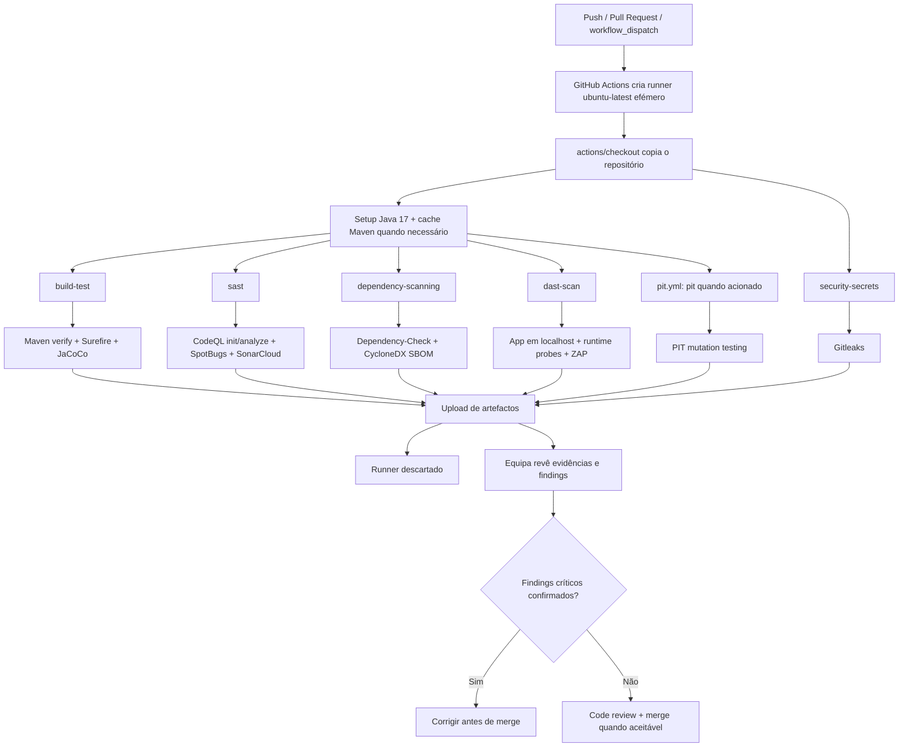
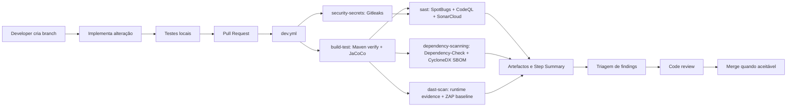
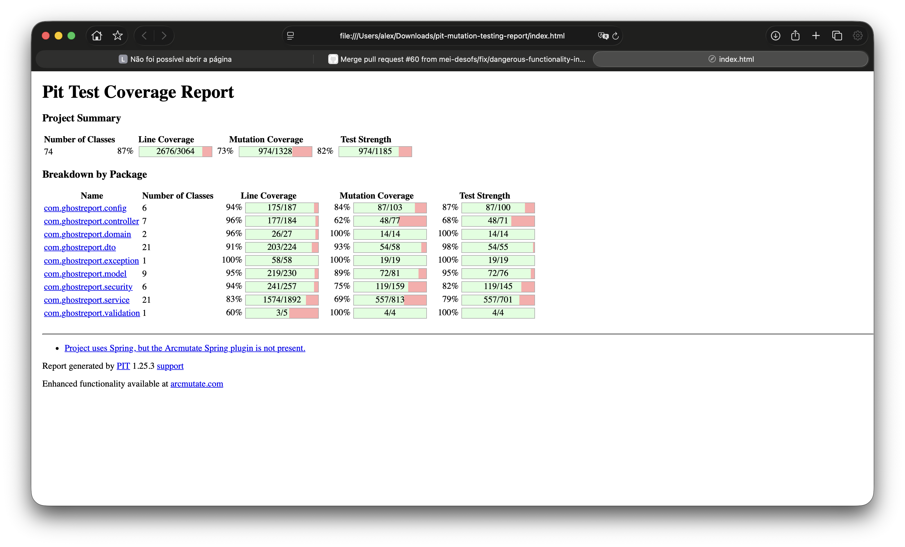
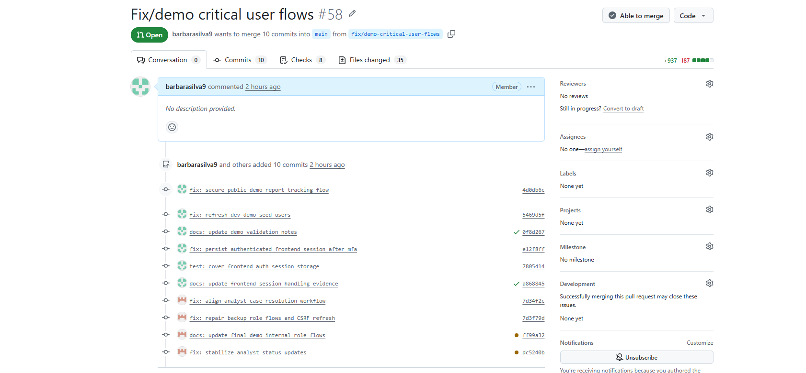

# Pipeline DevSecOps e automações

## 1. Objetivo

A pipeline DevSecOps do GhostReport transforma a entrega num processo reprodutível: compila, testa, mede cobertura, procura secrets, analisa código, verifica dependências, gera SBOM, arranca a aplicação, executa checks runtime, corre ZAP baseline e publica artefactos.

## 2. Workflows existentes

| Workflow                    | Triggers                                                                                                                                                                                      | Objetivo                                         |
| --------------------------- | --------------------------------------------------------------------------------------------------------------------------------------------------------------------------------------------- | ------------------------------------------------ |
| `.github/workflows/dev.yml` | `push` para `main`/`develop`, `pull_request` para `main`/`develop`, `workflow_dispatch`                                                                                                       | Pipeline principal de build, testes e segurança. |
| `.github/workflows/pit.yml` | `workflow_dispatch`, PRs para `main` quando mudam `ghostreport/pom.xml`, `ghostreport/src/main/**`, `ghostreport/src/test/**` ou o próprio workflow, e `push` para `main` com os mesmos paths | Mutation testing completo com PIT.               |

O workflow principal usa `concurrency` para cancelar execuções anteriores da mesma ref, evitando consumir runner em builds obsoletas.

`.github/dependabot.yml` também existe, mas não é um workflow de CI. Ele abre atualizações semanais para Maven e GitHub Actions; esses PRs disparam os workflows acima de acordo com os seus triggers e paths.

## 3. Como o GitHub Actions executa os jobs

Os workflows reais do repositório usam GitHub-hosted runners. Todos os jobs em `.github/workflows/dev.yml` e `.github/workflows/pit.yml` declaram `runs-on: ubuntu-latest`; não há `self-hosted` runner configurado. Cada job corre numa VM Linux efémera criada pelo GitHub para aquela execução e descartada no fim do job.

Consequências práticas:

* cada job arranca isolado, mesmo quando pertence ao mesmo workflow;
* os ficheiros criados em `ghostreport/target` existem apenas na cópia temporária do runner;
* os jobs não partilham ficheiros automaticamente entre si;
* ficheiros que precisam sobreviver ao job devem ser publicados como artefactos com `actions/upload-artifact`;
* dependências podem ser aceleradas por cache, mas a cache não é evidência e não deve guardar secrets.

O primeiro passo técnico relevante de cada job é o checkout: `actions/checkout@v6` copia o repositório para o workspace temporário do runner. A partir daí os comandos correm sobre essa cópia. No job `sast`, o checkout usa `fetch-depth: 0` para disponibilizar o histórico necessário a análises como SonarCloud; nos restantes jobs é usado o checkout padrão.

Os jobs Maven configuram Java com `actions/setup-java@v5`, distribuição `temurin`, `java-version: 17` e `cache: maven`. O Maven Wrapper do projeto aponta para Maven `3.9.14` em `ghostreport/.mvn/wrapper/maven-wrapper.properties`, por isso `./mvnw` garante uma versão Maven consistente no runner. A cache Maven reduz o tempo de download de dependências, mas não deve alterar o resultado da build: o `pom.xml`, o wrapper e os comandos executados continuam a definir o comportamento.

Serviços auxiliares também vivem apenas durante o job. `build-test` e `dast-scan` criam um serviço `postgres:16` associado ao job, exposto em `localhost:5432`, com base de dados `ghostreport`, utilizador `postgres` e password de teste `user`. Este PostgreSQL é usado por testes e runtime scan, e os dados desaparecem quando o job termina. `security-secrets`, `sast`, `dependency-scanning` e `pit` não declaram serviços; quando os testes correm sem esse serviço, o perfil de teste usa H2 em memória (`application-test.yaml`/`@ActiveProfiles("test")`). O runtime do `dast-scan` usa o perfil `dev`, que aponta para PostgreSQL através de `DB_URL`.

## 4. Fluxo completo developer -> merge

O fluxo esperado da equipa é:

1. O developer cria uma branch curta a partir de `main` ou `develop`.
2. Implementa a alteração e atualiza os testes/documentação quando o claim de segurança muda.
3. Corre localmente os testes relevantes; para o backend, o mínimo é `cd ghostreport; .\mvnw.cmd test`.
4. Abre uma pull request para `main` ou `develop` usando o template do repositório.
5. O workflow `dev.yml` arranca automaticamente para a pull request.
6. `build-test` executa `./mvnw verify`, os testes e o JaCoCo.
7. `security-secrets` executa Gitleaks contra o repositório.
8. `sast` compila, corre SpotBugs, CodeQL e SonarCloud quando o `SONAR_TOKEN` está configurado.
9. `dependency-scanning` executa OWASP Dependency-Check e gera a SBOM CycloneDX.
10. `dast-scan` corre testes runtime, arranca a aplicação, executa probes HTTP, verifica os logs e corre ZAP baseline.
11. Os artefactos e o GitHub Step Summary ficam disponíveis para revisão.
12. A equipa avalia os findings: confirmar, corrigir, justificar falso positivo ou documentar limitação.
13. Findings críticos confirmados bloqueiam o merge até à correção.
14. Findings informativos ou fora do âmbito podem ser aceites com justificação em triagem/documentação.
15. Só depois da revisão humana e de checks aceitáveis o PR deve ser merged.

**Visão rápida do mesmo fluxo:**

## 5. Quando corre e em que branches

| Evento                                | Branches/paths                             | Resultado esperado                                       |
| ------------------------------------- | ------------------------------------------ | -------------------------------------------------------- |
| Pull request para `main` ou `develop` | Qualquer alteração coberta pelo PR         | Executa a pipeline principal antes do merge.             |
| Push para `main` ou `develop`         | Commits diretos ou merges                  | Revalida a branch integrada.                             |
| `workflow_dispatch`                   | Manual                                     | Permite repetir a evidência ou validar a entrega.        |
| PIT PR/push                           | Apenas paths Java/Maven/workflow em `main` | Mutation testing quando altera código/testes relevantes. |

Branches de documentação continuam a disparar `dev.yml` quando abrem PR para as branches alvo, mas o PIT só corre se os paths configurados forem alterados.

## 6. Checks bloqueantes e findings aceitáveis

| Área                         | Modo no repositório                                           | Decisão de merge                                                                                                                                                          |
| ---------------------------- | ------------------------------------------------------------- | ------------------------------------------------------------------------------------------------------------------------------------------------------------------------- |
| Maven build/testes/JaCoCo    | `./mvnw verify` no job `build-test`                           | Bloqueante: a falha deve ser corrigida.                                                                                                                                   |
| Gitleaks                     | Job termina com exit code da ferramenta                       | Bloqueante para leaks confirmados. Falsos positivos devem ser justificados/remediados via configuração.                                                                   |
| SonarCloud                   | Falha se `SONAR_TOKEN` estiver ausente ou se a análise falhar | Bloqueante no estado atual do workflow; se o token não estiver configurado, a run deve ser tratada como limitação operacional, e não como evidência SonarCloud concluída. |
| CodeQL                       | `init` antes de SonarCloud e `analyze` depois de SonarCloud   | Findings confirmados de alta severidade devem ser corrigidos antes do merge. Se o SonarCloud falhar antes, o `analyze` não chega a executar nessa run.                    |
| SpotBugs                     | Gera evidência SAST no job `sast`                             | A falha técnica do comando bloqueia o job; findings confirmados devem ser corrigidos ou documentados em triagem.                                                          |
| Dependency-Check             | Evidence mode com `failBuildOnCVSS=11` e `continue-on-error`  | Não bloqueia automaticamente por CVSS; vulnerabilidades reais devem ser corrigidas ou justificadas em `SCA_TRIAGE.md`.                                                    |
| CycloneDX SBOM               | Gera `bom.json`/`bom.xml`                                     | Bloqueia apenas se a geração técnica falhar e a evidência for necessária.                                                                                                 |
| Runtime tests no `dast-scan` | Testes Maven selecionados                                     | Bloqueante para controlos runtime.                                                                                                                                        |
| ZAP baseline                 | `continue-on-error` com `-I`                                  | Evidência/review; findings são triados, não bloqueiam automaticamente.                                                                                                    |
| PIT                          | Workflow separado sem `continue-on-error`                     | Bloqueia a própria run quando falha, se o workflow for acionado; não substitui o gate rápido de PR do `dev.yml`.                                                          |

O repositório não contém configuração de branch protection. Portanto, a partir dos ficheiros só é possível afirmar quais os jobs que falham tecnicamente; se esses checks bloqueiam automaticamente o merge depende da configuração do GitHub no repositório remoto.

**Interpretação prática:**

* falha de compilação, testes, coverage ou secrets confirmados impede o merge;
* CVE explorável numa dependência utilizada deve ser corrigido antes de aceitar o PR;
* CVE não aplicável, falso positivo SAST ou alerta ZAP informativo pode ser aceite com justificação e ligação para a evidência;
* ausência de secret operacional, como `SONAR_TOKEN`, deve ser tratada como limitação de ambiente, e não como um claim de segurança implementado.
## 7. Job `build-test`

**Ambiente técnico:**

* workflow: `.github/workflows/dev.yml`;
* runner: `ubuntu-latest`;
* timeout: 35 minutos;
* working directory dos comandos: `./ghostreport`;
* serviço auxiliar: container `postgres:16` em `localhost:5432`;
* Java: Temurin 17 com cache Maven;
* Maven: `./mvnw`, usando o Maven Wrapper do projeto.

**Execução interna:**

* checkout;
* configuração Java 17 com cache Maven;
* `./mvnw verify` com `DB_URL`, `DB_USERNAME` e `DB_PASSWORD` apontados para o PostgreSQL efémero do job;
* upload de Surefire reports;
* upload de JaCoCo;
* publicação de sumário no GitHub Step Summary.

**Valor de segurança:**

* impede regressão funcional;
* garante que os testes de segurança entram no gate normal;
* gera artefactos revistos pelo professor/equipa;
* o JaCoCo evita que novas áreas fiquem sem cobertura mínima.

**Gate:** bloqueante para compilação, testes e regras JaCoCo, porque não usa `continue-on-error`.

## 8. Job `security-secrets`

**Ambiente técnico:**

* workflow: `.github/workflows/dev.yml`;
* runner: `ubuntu-latest`;
* timeout: 10 minutos;
* working directory dos comandos: `./ghostreport`;
* não configura Java porque a ferramenta corre em Docker;
* não usa serviço de base de dados.

**Execução interna:**

* corre Gitleaks em Docker;
* usa `.gitleaks.toml`;
* gera `target/gitleaks/gitleaks-report.json`;
* publica o artefacto `secret-scan-gitleaks-json`;
* escreve um sumário da evidência.

**Mitigação STRIDE:**

* reduz Information Disclosure por secrets commitados;
* ajuda a detetar tokens/passwords/keys antes do merge.

**Gate:** bloqueante para leaks confirmados, porque o script termina com o exit code do Gitleaks. O relatório é redigido com `--redact`.

## 9. Job `sast`

**Ambiente técnico:**

* workflow: `.github/workflows/dev.yml`;
* runner: `ubuntu-latest`;
* timeout: 30 minutos;
* depende de `build-test` e `security-secrets`;
* working directory dos comandos: `./ghostreport`;
* Java: Temurin 17 com cache Maven;
* cache adicional: `~/.sonar/cache` com `actions/cache@v5`;
* permissions incluem `security-events: write` para CodeQL/Code Scanning.

**Execução interna:**

* inicializa o CodeQL para Java;
* compila o projeto para análise;
* corre SpotBugs;
* corre SonarCloud usando `SONAR_TOKEN` e variáveis de projeto/organização quando configuradas;
* executa o CodeQL analyze;
* publica `sast-reports`.

**Notas importantes:**

* o CodeQL envia resultados para o GitHub Code Scanning;
* o SpotBugs gera XML/site como evidência;
* o SonarCloud depende do secret `SONAR_TOKEN`;
* `SONAR_PROJECT_KEY` e `SONAR_ORGANIZATION` são lidos das GitHub Actions vars, com valores por defeito no script;
* se `SONAR_TOKEN` estiver ausente, o script escreve `target/sast-evidence/sonarcloud-summary.txt` e falha o job antes do passo `Run CodeQL analysis`;
* SAST é evidência complementar, não prova a ausência de vulnerabilidades.

**Gate:** bloqueante para falhas técnicas do job SAST. Findings SAST devem ser triados; findings confirmados de severidade alta/crítica devem ser corrigidos antes do merge.

## 10. Job `dependency-scanning`

**Ambiente técnico:**

* workflow: `.github/workflows/dev.yml`;
* runner: `ubuntu-latest`;
* timeout: 25 minutos;
* depende de `build-test` e `security-secrets`;
* working directory dos comandos: `./ghostreport`;
* Java: Temurin 17 com cache Maven;
* sem serviço de base de dados;
* permissions incluem `security-events: write` para upload SARIF.

**Execução interna:**

* OWASP Dependency-Check `12.1.0`;
* formatos HTML/XML/JSON/SARIF;
* upload SARIF para GitHub Code Scanning quando gerado;
* CycloneDX `makeAggregateBom`;
* artefactos `dependency-check-sca-reports` e `sbom-cyclonedx`;
* sumário no Step Summary.

**Evidência recente:**

* os alertas do Spring Security `6.5.10` foram corrigidos;
* o Spring Boot BOM `3.5.15` resolve o Spring Security `6.5.11`;
* a SBOM permite listar componentes e suportar triagem futura.

**Gate:** o passo Dependency-Check usa `continue-on-error: true` e `failBuildOnCVSS=11`, por isso as vulnerabilidades detetadas funcionam como evidência de triagem e não como gate automático por CVSS. Falhas técnicas posteriores, como a impossibilidade de gerar a SBOM, podem fazer falhar o job.

## 11. Job `dast-scan`

**Ambiente técnico:**

* workflow: `.github/workflows/dev.yml`;
* runner: `ubuntu-latest`;
* timeout: 35 minutos;
* depende de `build-test` e `security-secrets`;
* working directory dos comandos: `./ghostreport`;
* serviço auxiliar: container `postgres:16` em `localhost:5432`;
* Java: Temurin 17 com cache Maven;
* runtime: JAR Spring Boot iniciado em `http://localhost:8081` com perfil `dev`;
* OWASP ZAP corre em container Docker com `--network host`.

**Execução interna:**

* corre testes runtime de segurança selecionados;
* empacota a aplicação;
* arranca o GhostReport em `localhost:8081` usando o PostgreSQL efémero do job;
* espera pela readiness;
* exercita páginas públicas, reports, tracking code, uploads, download/listagem de anexos, login/MFA/logout/password reset, endpoints admin, analyst e auditor, JWT inválido, Authorization malformado e outros casos negativos;
* verifica os logs para fuga de dados sensíveis;
* corre OWASP ZAP baseline;
* prepara o sumário IAST-like/runtime;
* publica `iast-runtime-security-evidence`;
* publica `dast-zap-baseline-reports`;
* termina o processo no fim.

O ZAP baseline é evidência passiva/não autenticada. A parte runtime cobre mais do que o ZAP sozinho, porque combina testes, aplicação real, HTTP probes e logs.

**Validação local expandida do probe em 2026-06-15:**

| Métrica                 | Valor |
| ----------------------- | ----- |
| Total de probes         | 101   |
| Passed                  | 101   |
| Failed                  | 0     |
| Skipped                 | 0     |
| Public endpoint probes  | 23    |
| Admin endpoint probes   | 22    |
| Analyst endpoint probes | 17    |
| Auditor endpoint probes | 13    |
| Negative-case probes    | 6     |

Não houve probes skipped na validação local. `GET /login.html` é tratado como controlo de exposição quando responde `401/404`, e o restore destrutivo de backup continua fora do probe runtime porque exige reautenticação e é coberto por testes automatizados. O workflow publica o JSON `runtime-probe-summary.json` para confirmar estes números em cada run.

**Artefactos documentados na entrega:**

* [iast-runtime-evidence.md](iast-runtime-evidence.md)
* [runtime-endpoints.md](runtime-endpoints.md)
* [runtime-log-sanitization.md](runtime-log-sanitization.md)

**Gate:** os testes runtime, a build do JAR, o arranque da aplicação e a readiness são bloqueantes. O passo ZAP usa `continue-on-error: true` e `-I`, por isso funciona como evidência DAST baseline/passiva; os findings do ZAP precisam de triagem humana.

## 12. Workflow `pit-mutation-testing`

**Ambiente técnico:**

* workflow: `.github/workflows/pit.yml`;
* job: `pit`;
* runner: `ubuntu-latest`;
* timeout: 90 minutos;
* triggers: `workflow_dispatch`, PRs para `main` e pushes para `main` quando mudam `ghostreport/pom.xml`, `ghostreport/src/main/**`, `ghostreport/src/test/**` ou `.github/workflows/pit.yml`;
* working directory dos comandos: `./ghostreport`;
* Java: Temurin 17 com cache Maven;
* sem serviço de base de dados.

**Execução interna:**

* prepara Java 17 e cache Maven;
* compila os testes;
* inventaria as classes alvo;
* executa o PIT com a configuração do `pom.xml`;
* valida a existência de `target/pit-reports/index.html`;
* gera um sumário em Markdown;
* publica `pit-mutation-testing-report`.

O PIT fica separado porque é mais lento. Serve para avaliar a qualidade dos testes e não para bloquear rapidamente todos os commits.

### Evidencia visual PIT

O screenshot seguinte mostra o resumo HTML gerado pelo PIT para a execucao de mutation testing. Nesta evidência, o projeto apresenta 74 classes analisadas, 87% de line coverage, 73% de mutation coverage e 82% de test strength. Estes valores complementam o JaCoCo: enquanto a cobertura de linhas indica que partes do código foram executadas pelos testes, o PIT introduz mutações artificiais no código e verifica se a suite consegue detetar alterações de comportamento. Assim, o relatório ajuda a identificar zonas onde os testes passam por executar código, mas ainda podem não validar suficientemente as regras de negócio ou controlos de segurança.

**Gate:** sem `continue-on-error`; falha se não encontrar classes alvo, se o PIT falhar ou se `target/pit-reports/index.html` não for gerado. O artefacto usa `if-no-files-found: error`.

## 13. Artefactos esperados

Artefactos de GitHub Actions são ficheiros copiados do runner para o run do workflow, para revisão posterior. Eles são diferentes dos ficheiros temporários do workspace: sem upload por `actions/upload-artifact`, os relatórios gerados no runner desaparecem quando a VM efémera é descartada.

| Artefacto                        | Origem                          | Uso                        |
| -------------------------------- | ------------------------------- | -------------------------- |
| `ci-surefire-test-reports`       | `build-test`                    | Evidência de testes.       |
| `ci-jacoco-coverage-report`      | `build-test`                    | Cobertura.                 |
| `secret-scan-gitleaks-json`      | `security-secrets`              | Secrets scan.              |
| `sast-reports`                   | `sast`                          | SpotBugs/SonarCloud notes. |
| GitHub Code Scanning alerts      | CodeQL e Dependency-Check SARIF | Findings centralizados.    |
| `dependency-check-sca-reports`   | `dependency-scanning`           | SCA HTML/XML/JSON/SARIF.   |
| `sbom-cyclonedx`                 | `dependency-scanning`           | SBOM JSON/XML.             |
| `iast-runtime-security-evidence` | `dast-scan`                     | Runtime/IAST-like.         |
| `dast-zap-baseline-reports`      | `dast-scan`                     | ZAP HTML/XML/JSON e logs.  |
| `pit-mutation-testing-report`    | `pit.yml`                       | Mutation testing.          |

Os workflows não definem `retention-days`, por isso a retenção concreta segue a configuração por defeito do GitHub/repositório/organização. Não se deve assumir que os artefactos ficam guardados para sempre.

Os artefactos temporários gerados em `target/` não devem ser commitados no repositório; a documentação da entrega referencia o tipo de evidência e, quando útil, inclui resumos em Markdown.

## 14. Cache, artefactos, secrets e variáveis

A cache e os artefactos não resolvem o mesmo problema:

* a cache Maven (`actions/setup-java` com `cache: maven`) acelera as builds ao reaproveitar dependências descarregadas;
* a cache Sonar (`actions/cache` em `~/.sonar/cache`) acelera o job `sast`;
* os artefactos guardam evidências como Surefire, JaCoCo, Dependency-Check, SBOM, SpotBugs, ZAP, logs runtime e PIT;
* nenhum deles deve ser usado para guardar secrets.

**Secrets e variáveis vistos nos workflows:**

| Nome                                                | Tipo                         | Onde aparece              | Uso                                                         |
| --------------------------------------------------- | ---------------------------- | ------------------------- | ----------------------------------------------------------- |
| `SONAR_TOKEN`                                       | GitHub Actions secret        | `sast`                    | Autenticar o SonarCloud.                                    |
| `SONAR_PROJECT_KEY`                                 | GitHub Actions variable      | `sast`                    | Project key do SonarCloud, com valor por defeito no script. |
| `SONAR_ORGANIZATION`                                | GitHub Actions variable      | `sast`                    | Organização do SonarCloud, com valor por defeito no script. |
| `NVD_API_KEY`                                       | GitHub Actions secret        | `dependency-scanning`     | Passado ao Dependency-Check quando configurado.             |
| `DB_URL`, `DB_USERNAME`, `DB_PASSWORD`              | Variáveis de ambiente do job | `build-test`, `dast-scan` | Credenciais de teste para o PostgreSQL efémero do job.      |
| `POSTGRES_DB`, `POSTGRES_USER`, `POSTGRES_PASSWORD` | Variáveis do serviço         | `build-test`, `dast-scan` | Configuração do container `postgres:16`.                    |

`POSTGRES_PASSWORD: user` e `DB_PASSWORD: user` são credenciais de teste dentro do runner efémero, não GitHub Actions secrets. Os secrets reais são injetados no runner apenas durante o job que os declara e não devem ser impressos nos logs, incluídos na SBOM nem guardados em artefactos. O Gitleaks procura secrets commitados no repositório; isso é diferente de usar secrets de runtime injetados pelo GitHub Actions.

O job `dast-scan` também procura nos logs padrões sensíveis, incluindo nomes como `JWT_SECRET` e `BACKUP_HMAC_SECRET`. Essa verificação indica apenas que o workflow procura fugas desses padrões nos logs; não significa que esses secrets estejam configurados no GitHub Actions.

## 15. Relação com STRIDE

| STRIDE                 | Pipeline/automação                                                            |
| ---------------------- | ----------------------------------------------------------------------------- |
| Spoofing               | Testes de auth/JWT/MFA no build; runtime probes em CI.                        |
| Tampering              | Testes de backup/package integrity; SAST; dependency scanning.                |
| Repudiation            | Testes de audit logs; runtime logs arquivados.                                |
| Information Disclosure | Gitleaks, frontend XSS/data exposure tests, log leakage checks, ZAP baseline. |
| Denial of Service      | Rate limiter tests, upload limits, ZAP baseline como sinal passivo.           |
| Elevation of Privilege | RBAC/ownership tests no build; CodeQL/SpotBugs como apoio.                    |

## Code review process

O fluxo de revisão pretendido no GhostReport é branch-based: as alterações são isoladas em branches, revistas por pull request e validadas por workflows antes de serem integradas. A evidência local do repositório confirma merges de PRs, branches `feature/*`, `fix/*`, `docs/*`, `security/*`/`ci-*`, Dependabot e os workflows `dev.yml` e `pit.yml`. A metadata detalhada de aprovações/reviewers deve ser confirmada na interface do GitHub, porque não fica totalmente disponível no clone local.

O code review não é apenas leitura manual. Ele combina revisão humana, testes, análise estática, análise de dependências, runtime evidence, ZAP baseline, artefactos e revisão da documentação.

**Fluxo de revisão:**

1. Criar uma branch curta com âmbito claro.
2. Implementar a alteração mantendo a arquitetura existente.
3. Correr os testes locais relevantes; para o backend, o mínimo recomendado é `cd ghostreport; .\mvnw.cmd test`.
4. Abrir uma pull request com resumo, motivo e impacto de segurança.
5. Validar a run de `dev.yml`: build/testes/JaCoCo, Gitleaks, SAST, Dependency-Check, SBOM, runtime evidence e ZAP baseline.
6. Executar ou rever `pit.yml` quando a alteração toca em código/testes Java e o custo temporal se justifica.
7. Triar findings: corrigir, aceitar com justificação, suprimir com prazo de revisão ou documentar a limitação.
8. Atualizar os testes, a matriz de autorização, o ASVS ou os anexos quando uma claim de segurança muda.
9. Integrar apenas quando os checks e os riscos confirmados forem aceitáveis.

### Code review responsibilities

| Área revista   | O que é verificado                                                                 | Evidência                                                                 |
| -------------- | ---------------------------------------------------------------------------------- | ------------------------------------------------------------------------- |
| Funcionalidade | A alteração cumpre o objetivo e não quebra fluxos existentes.                      | Testes Maven, runtime probes e revisão manual.                            |
| Segurança      | Autenticação, autorização, validação, logging, uploads, backups, errors e secrets. | Security tests, SAST, DAST/runtime, Gitleaks e `AUTHORIZATION_MATRIX.md`. |
| Dependências   | CVEs, versões vulneráveis, suppressions e SBOM.                                    | Dependency-Check, Dependabot, CycloneDX e `SCA_TRIAGE.md`.                |
| Qualidade      | Code smells, duplicação, complexidade, cobertura e mutações quando aplicável.      | SonarCloud, SpotBugs, JaCoCo e PIT.                                       |
| Documentação   | Claims técnicos alinhados com código, outputs e artefactos.                        | README, relatório principal, ASVS XLSX e anexos.                          |

### Security review checklist

* A alteração muda a autenticação, autorização, roles ou ownership?
* A alteração cria ou altera um endpoint?
* O endpoint foi adicionado a `AUTHORIZATION_MATRIX.md`?
* Existem testes positivos e negativos para as roles relevantes?
* Há validação de input por DTO, Bean Validation, enum ou allowlist?
* Há risco de mass assignment por binding indevido?
* Há risco de path traversal, ZIP Slip ou acesso indevido ao filesystem?
* Há risco de expor passwords, JWTs, tracking codes, MFA codes, secrets, stack traces ou paths internos?
* A alteração afeta uploads, backups, evidence packages ou logs?
* A alteração adiciona ou atualiza dependências?
* O impacto em SCA/SBOM foi revisto?
* A documentação e a evidência ASVS foram atualizadas quando a claim mudou?

### Coding standards and naming conventions

O projeto segue convenções leves alinhadas com a estrutura real do código:

| Area | Regra | Validacao |
| --- | --- | --- |
| Controllers | Recebem HTTP, aplicam validacao inicial/DTOs e devolvem respostas; nao devem concentrar regras de negocio. | Code review, MockMvc e testes de controller/security. |
| Services | Centralizam regras de negocio, ownership, workflow, filesystem seguro e decisoes sensiveis. | Testes unitarios/integracao em `service` e `security`. |
| Repositories | Limitados a persistencia Spring Data/JPA. | Revisao de codigo e testes de integracao. |
| DTOs | Requests/responses evitam expor entidades JPA directamente e reduzem mass assignment. | API tests, review e checklist de seguranca desta seccao. |
| Validacao | Usar Bean Validation, enums, allowlists e domain primitives quando fizer sentido. | `ApiValidationContractTest`, testes de dominio e security tests. |
| Frontend | Guardar JWT apenas em `sessionStorage` durante a sessao academica, nunca em `localStorage`, limpar no logout e evitar sinks XSS. | `FrontendXssDataExposureTest` e runtime probes. |
| Logs/erros | Nao escrever passwords, JWTs, tracking codes, MFA codes ou secrets; nao devolver stack traces/paths internos. | Runtime log sanitization, `ErrorHandlingSecurityTest` e audit/logging tests. |
| Endpoints | Novas rotas devem seguir agrupamento por contexto e ter RBAC positivo/negativo. | [AUTHORIZATION_MATRIX.md](AUTHORIZATION_MATRIX.md) e `RbacAuthorizationMatrixTest`. |
| Dependencias | CVEs devem ser triados e SBOM actualizado. | [SCA_TRIAGE.md](SCA_TRIAGE.md), Dependency-Check e CycloneDX. |
| Documentacao | Numeros e claims devem vir de outputs reais ou artefactos verificaveis. | README, relatorio, ASVS XLSX e anexos. |

**Convenções observadas:**

| Tipo                       | Convenção usada                                                                                                 |
| -------------------------- | --------------------------------------------------------------------------------------------------------------- |
| Controllers                | `*Controller.java`, por exemplo `AdminController` e `AdminBackupController`.                                    |
| Services                   | `*Service.java`, por exemplo `JwtService`, `MfaChallengeService`, `BackupService`.                              |
| Repositories               | `*Repository.java`.                                                                                             |
| DTO/request/response       | `*Request.java`, `*Response.java` ou `*Dto.java`.                                                               |
| Security/config            | Nome associado ao controlo, como `SecurityConfig`, `JwtAuthenticationFilter`, `SecurityConfigurationValidator`. |
| Testes                     | `*Test.java`, `*IntegrationTest.java` ou nomes descritivos de security tests.                                   |
| Documentação principal     | Anexos principais em `UPPER_SNAKE_CASE.md`.                                                                     |
| Evidência gerada/espelhada | Artefactos runtime em `kebab-case.md`, como `runtime-endpoints.md`.                                             |

As novas rotas devem respeitar o agrupamento atual:

* público: `/reports`, `/reports/verify`, `/reports/download`;
* autenticação: `/auth/**`;
* administração: `/admin/**`;
* analista: `/analyst/**`;
* auditoria: `/audit/**`.

Os endpoints públicos não devem expor dados internos, paths, hashes, stack traces, tokens ou tracking codes na URL. As operações sensíveis devem exigir a role adequada e, quando aplicável, validação adicional como tracking code, ownership, CSRF ou reautenticação.

### Branch and commit naming

O histórico local mostra branches `feature/*`, `fix/*`, `docs/*`, `security/*` e `ci`/pipeline-oriented, mas os commits antigos não são totalmente uniformes. Por isso, as convenções abaixo devem ser tratadas como prática recomendada e evolução do processo, não como regra histórica absoluta:

| Prefixo                     | Uso recomendado                                                 |
| --------------------------- | --------------------------------------------------------------- |
| `feature/...` ou `feat/...` | Novas funcionalidades.                                          |
| `fix/...`                   | Correção funcional, de segurança ou de regressão.               |
| `docs/...`                  | Documentação e evidência.                                       |
| `test/...`                  | Testes, probes e evidência automatizada.                        |
| `security/...`              | Alterações diretamente relacionadas com controlos de segurança. |
| `ci/...`                    | Workflows, automações e artefactos.                             |

Os commits devem preferir Conventional Commits simples: `feat:`, `fix:`, `docs:`, `test:`, `refactor:`, `security:` e `ci:`.

**Critérios de triagem:**

| Resultado                                    | Tratamento                                                                                  |
| -------------------------------------------- | ------------------------------------------------------------------------------------------- |
| Vulnerabilidade confirmada em código próprio | Corrigir o código e adicionar/atualizar o teste.                                            |
| CVE em dependência direta/transitiva usada   | Atualizar a versão/BOM ou justificar a mitigação temporária.                                |
| Falso positivo SCA/SAST                      | Documentar o componente, a regra/CVE, o motivo e a data de revisão.                         |
| ZAP baseline informativo                     | Avaliar o impacto; corrigir se expuser controlos reais ou documentar como hardening futuro. |
| Evidência incompleta por ambiente            | Repetir o workflow ou documentar a limitação operacional sem a transformar em claim.        |

**Tabela de decisão operacional:**

| Tipo de finding                          | Decisão esperada                                                              |
| ---------------------------------------- | ----------------------------------------------------------------------------- |
| Build, testes ou JaCoCo falham           | Corrigir antes do merge.                                                      |
| Secret confirmado                        | Remover, rodar o secret quando aplicável e bloquear o merge até à remediação. |
| CVE aplicável/explorável                 | Atualizar a dependência/BOM ou documentar a mitigação temporária.             |
| CVE não aplicável/falso positivo         | Documentar a suppression específica, o motivo e o prazo de revisão.           |
| CodeQL/Sonar/SpotBugs crítico confirmado | Corrigir antes do merge ou documentar o risco se não for explorável.          |
| ZAP baseline informativo                 | Triar e aceitar com justificação se não representar risco real.               |
| Runtime probe falha                      | Corrigir o endpoint, o teste ou a evidência antes de aceitar a entrega.       |
| PIT fraco em área crítica                | Adicionar testes quando fizer sentido para o risco.                           |
| Evidência incompleta por ambiente        | Repetir o workflow ou documentar a limitação sem a transformar em claim.      |

### Code review evidence

| Evidência local                                                | Objetivo                                                            | Checks relevantes                      | Limite da evidência                                                |
| -------------------------------------------------------------- | ------------------------------------------------------------------- | -------------------------------------- | ------------------------------------------------------------------ |
| Merge PR `#53` de `fix/asvs-final-l1-l2-l3-hardening`          | Hardening ASVS e `SecurityConfig`.                                  | Build/testes, docs ASVS e triagem ZAP. | Aprovações/reviewers devem ser vistos no GitHub.                   |
| Merge PR `#52` de `docs/complete-sprint2-documentation`        | Consolidação da documentação Sprint 2 e evidência runtime/SCA/ASVS. | Docs, runtime probes, SCA e ASVS.      | A metadata detalhada da review não está no clone local.            |
| Merge PR `#51` de `docs/finalize-phase2-sprint2-documentation` | Finalização da Sprint 2, MFA, PIT/runtime e coverage.               | Maven, PIT, DAST/runtime e docs.       | O resultado exato dos checks deve ser consultado na run do GitHub. |
| Merge PR `#50` de `fix/spring-security-dependency-alerts`      | Remediação das CVEs do Spring Security via BOM.                     | SCA, dependency tree e testes.         | As aprovações formais não são visíveis localmente.                 |
| Merge PR `#48` de `feat/project-final-review`                  | Revisão final, MFA/admin e documentação.                            | Testes, docs e security review.        | A metadata dos reviewers não fica preservada no log local.         |
| `.github/dependabot.yml`                                       | PRs semanais para Maven e GitHub Actions.                           | Dependency review, SCA e workflows.    | O Dependabot não substitui a triagem humana.                       |

Local repository evidence confirms branch-based development, automated security workflows and documented triage gates. GitHub pull request approval metadata must be checked in the GitHub interface because it is not fully available from the local repository clone.

Como apoio visual à apresentação, o screenshot abaixo mostra um exemplo de pull request com branch dedicada, commits associados, checks e estado de merge. A imagem não deve ser lida como prova de aprovação formal; essa metadata deve ser confirmada no GitHub.

### Relationship with ASVS

O code review suporta evidências ASVS em secure coding, autenticação, autorização, validação, logging, configuração, dependency management, error handling e runtime testing. Quando uma alteração muda uma claim ASVS, o tracker Excel continua a ser a fonte principal e `ASVS_EVIDENCE.md` funciona como resumo explicativo.

### Triagem ZAP atual

| Finding ZAP                                             | Estado               | Decisão técnica                                                                                                         |
| ------------------------------------------------------- | -------------------- | ----------------------------------------------------------------------------------------------------------------------- |
| `CSP: Notices`                                          | Corrigido            | `SecurityConfig` usa `report-to csp-endpoint` e o header `Report-To` em vez de depender de `report-uri`.                |
| `Cookie No HttpOnly Flag` (`XSRF-TOKEN`)                | Aceite               | O frontend precisa de ler o cookie para enviar `X-XSRF-TOKEN`; não é um cookie de sessão/JWT e fica com `SameSite=Lax`. |
| `Non-Storable Content`                                  | Aceite informacional | `no-store` é mantido para endpoints/páginas sensíveis.                                                                  |
| `Session Management Response Identified` (`XSRF-TOKEN`) | Aceite informacional | O cookie identifica proteção CSRF, não uma sessão autenticada.                                                          |

## 17. Limitações da pipeline

* A branch protection e a configuração do GitHub não são totalmente comprováveis através dos ficheiros.
* O SonarCloud depende de `SONAR_TOKEN`.
* O ZAP baseline não é um DAST autenticado completo.
* O IAST é runtime/academic substitute, não agent-based.
* O PIT pode ser demorado e, por isso, fica separado.
