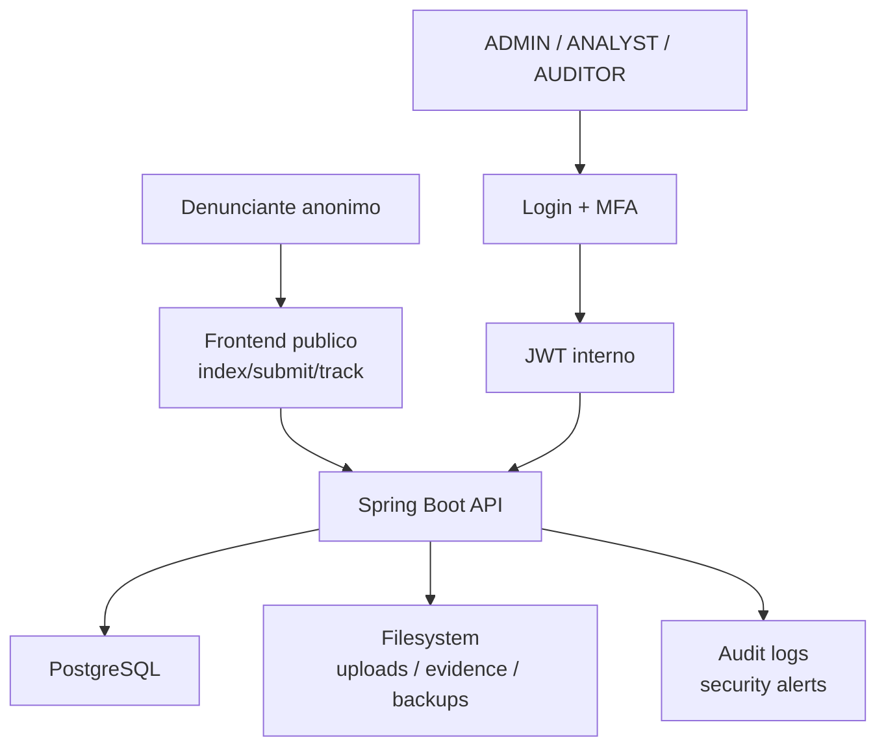

# GhostReport - Relatório Final Phase 2 Sprint 2

## 1. Introdução

GhostReport é uma plataforma web para submissão anónima de denúncias,
acompanhamento por código de tracking, análise interna por analistas, consulta
de auditoria por auditores e administração segura da aplicação. O projeto foi
desenvolvido no contexto de DESOFS com foco em engenharia de software segura:
modelação de ameaças, desenho orientado ao dóminio, controlos defensivos,
automatização DevSecOps e evidência técnica verificável.

Este documento é o relatório principal da Phase 2 Sprint 2. Ao contrário de um
sumário curto, pretende explicar o sistema final de ponta a ponta: requisitos,
arquitetura, roles, endpoints, pipeline, automações, testes, STRIDE,
mitigações, SCA/SAST/DAST, evidência runtime/IAST-like, configuração segura,
rastreabilidade ASVS, limitações e trabalho futuro.

A narrativa deve ser lida como evidência de um protótipo académico com
hardening prod-like. O projeto não e apresentado como produção empresarial
completa. Do mesmo modo, a evidência runtime e IAST-like/academic substitute,
não um IAST agent-based completo com taint tracking.

Os documentos complementares desta pasta funcionam como anexos técnicos:

- [AUTHORIZATION_MATRIX.md](AUTHORIZATION_MATRIX.md)
- [SECURITY_TESTING.md](SECURITY_TESTING.md)
- [DEVSECOPS_PIPELINE.md](DEVSECOPS_PIPELINE.md)
- [SCA_TRIAGE.md](SCA_TRIAGE.md)
- [SPOTBUGS_TRIAGE.md](SPOTBUGS_TRIAGE.md)
- [IAST_RUNTIME_SECURITY.md](IAST_RUNTIME_SECURITY.md)
- [SECURE_INSTALLATION.md](SECURE_INSTALLATION.md)
- [SECURITY_CONFIGURATION_ASSESSMENT.md](SECURITY_CONFIGURATION_ASSESSMENT.md)
- [SECURITY_ASSESSMENT.md](SECURITY_ASSESSMENT.md)
- [ASVS_5.0_Tracker_Phase_2_Sprint_2.xlsx](ASVS_5.0_Tracker_Phase_2_Sprint_2.xlsx)
- [ASVS_EVIDENCE.md](ASVS_EVIDENCE.md)

Para ASVS, o ficheiro XLSX e a fonte principal de estados e percentagens. O
ficheiro Markdown de evidencia ASVS e apenas um resumo explicativo e apontador
para documentos de suporte.

## 2. Relação com Phase 1 e Sprint 1

Na Phase 1 foi definida a base de seguranca do GhostReport: actores, trust
boundaries, abuse cases, attack trees, DFDs, modelo DDD e STRIDE. O objectivo
principal era identificar ameaças antes da implementação, especialmente:

- exposição da identidade do denunciante;
- enumeração ou abuso de códigos de tracking;
- acesso indevido a dados internos;
- upload de ficheiros maliciosos;
- path traversal e ZIP Slip;
- alteração de evidências, logs ou backups;
- uso indevido de roles administrativas.

Na Phase 2 Sprint 1 foram implementados os controlos base: autenticacao JWT,
RBAC, DTOs/validação, submissão anónima, tracking code, upload seguro,
auditoria, alertas de seguranca, backups e pacotes de evidência.

Na Sprint 2 o trabalho passou de "funcionalidade segura" para "entrega segura".
Foram reforcados MFA para todas as roles internas, pipeline DevSecOps,
SCA/SAST/DAST, evidência runtime/IAST-like, instalação segura, avaliação de
configuração, documentação ASVS e revisão final.

Resumo da evolução:

| Area | Sprint 1 | Sprint 2 |
| --- | --- | --- |
| Autenticacao interna | Login JWT base para utilizadores internos. | Password + MFA antes da emissao de JWT para `ADMIN`, `ANALYST` e `AUDITOR`. |
| RBAC | Regras base por role. | Matriz completa por endpoint, testes negativos e ownership em fluxos de analista. |
| Denuncias anonimas | Submissao e tracking code implementados. | Tracking, anexos, downloads e enumeracao exercitados por testes e runtime probes. |
| Uploads/backups | Controlos de filesystem implementados. | Quotas, manifestos, HMAC, restore com reautenticacao e minimizacao de respostas reforcados. |
| SCA/SBOM | Dependency-Check base. | CVEs Spring Security triados/remediados, suppressions justificadas, SBOM CycloneDX em job separado e Trivy image scan. |
| Runtime evidence | Evidencia inicial limitada. | 101 probes runtime/IAST-like: 101 passed, 0 failed, 0 skipped. |
| Testes | Suite de seguranca base. | 299 testes Maven confirmados, incluindo ASVS hardening e cenarios negativos. |
| ASVS | Tracker Sprint 1 como base. | XLSX Sprint 2 copiado estruturalmente e actualizado com evidencia factual. |

## 3. Objetivos da Sprint 2

Os objetivos concretos da Sprint 2 foram:

| Objectivo                         | Resultado                                                               |
|-----------------------------------|-------------------------------------------------------------------------|
| Consolidar a aplicação final      | Fluxos anonimos, analista, auditor e admin documentados e testados.     |
| Reforcar autenticação             | MFA antes da emissão de JWT para `ADMIN`, `ANALYST` e `AUDITOR`.        |
| Validar autorização               | Matriz de endpoints e testes RBAC/ownership.                            |
| Produzir evidência DevSecOps      | Workflows com build, testes, SCA, SAST, DAST, SBOM, secrets scan e PIT. |
| Documentar segurança runtime      | Evidência runtime/IAST-like sem afirmar IAST agent-based completo.      |
| Corrigir dependências vulneráveis | Spring Security `6.5.10` substituído por `6.5.11` via Spring Boot BOM.  |
| Organizar entrega final           | Pasta Sprint 2 limpa, com relatório principal e anexos úteis.           |

## 4. Requisitos do projeto e cumprimento

| Requisito                                      | Implementacao no GhostReport                                                                                      |
|------------------------------------------------|-------------------------------------------------------------------------------------------------------------------|
| Backend web API                                | Spring Boot REST controllers.                                                                                     |
| Base de dados relacional                       | PostgreSQL em runtime/dev/prod-like; H2 apenas em testes.                                                         |
| Pelo menos três agregados DDD                  | `Report`, `CaseReview`, `User`; entidades de auditoria, alertas, anexos, tokens e backups complementam o dominio. |
| Pelo menos três roles                          | `ADMIN`, `ANALYST`, `AUDITOR`.                                                                                    |
| Funcionalidade de sistema operativo no backend | Uploads em filesystem, downloads, pacotes ZIP de evidência, backups ZIP, verificação de manifestos.               |
| Desenvolvimento seguro                         | Validação, RBAC, MFA, auditoria, SCA/SAST/DAST, testes e documentação ASVS.                                       |

## 5. Arquitetura final

### 5.1 Camadas

| Camada            | Responsabilidade                                                        |
|-------------------|-------------------------------------------------------------------------|
| Frontend estático | Paginas HTML/CSS/JS para submissão, tracking, páineis internos e MFA.   |
| Controllers REST  | Entrada HTTP, DTOs, validação, resposta JSON/ficheiros.                 |
| Services          | Regras de negócio, ownership, audit logging, backup, packages, uploads. |
| Repositories      | Persistência JPA.                                                       |
| Security          | Spring Security, JWT filter, RBAC, MFA, CSRF, headers e rate limiting.  |
| Storage           | PostgreSQL para dados; filesystem para anexos, evidências e backups.    |

### 5.2 Topologia logica



### 5.3 Stack

| Area              | Tecnologia                                                                                           |
|-------------------|------------------------------------------------------------------------------------------------------|
| Linguagem/runtime | Java 17                                                                                              |
| Backend           | Spring Boot `3.5.15`                                                                                 |
| Segurança         | Spring Security `6.5.11`, JWT, BCrypt, MFA, CSRF token cookie                                        |
| Persistência      | Spring Data JPA, Hibernate, PostgreSQL                                                               |
| Testes            | JUnit 5, MockMvc, AssertJ, JaCoCo, PIT                                                               |
| DevSecOps         | GitHub Actions, CodeQL, SonarCloud, SpotBugs, OWASP Dependency-Check, CycloneDX, Gitleaks, OWASP ZAP |
| Frontend          | HTML/CSS/JavaScript estático                                                                         |

## 6. Modelo de dominio

### 6.1 Report

`Report` representa a denuncia anonima. Contém título, descriçãoo, categoria,
estado, tracking code e associação a anexos. O tracking code é o único mecanismo
publico para o denunciante acompanhar ou recuperar evidência, evitando contas de
reporter e reduzindo exposição de identidade.

Controlos associados:

- tracking code validado por formato;
- erros génericos para evitar enumeração;
- rate limiting em submissão pública, verificação e download;
- DTOs para impedir mass assignment;
- descrição e categoria validadas.

### 6.2 CaseReview

`CaseReview` representa o trabalho interno de analise. Liga uma denúncia a um
analista, prioridade, notas internas e estado do caso.

Controlos associados:

- analista so consulta/atualiza casos elegíveis ou atribuídos;
- auditor não pode modificar casos;
- admin tem acesso de oversight;
- casos fechados não devem ser alterados parcialmente;
- alterações relevantes geram auditoria.

### ### 6.3 User

`User` representa os utilizadores internos. As roles ativas são `ADMIN`, `ANALYST` e `AUDITOR`. Não existe uma role geral `USER` no modelo protegido atual.

**Controlos associados:**

* Password protegida com BCrypt;
* Política de passwords;
* Utilizadores inativos bloqueados;
* MFA obrigatório, por omissão, para as três roles internas;
* Gestão do ciclo de vida dos administradores, com proteção contra a remoção do último administrador ativo.


## ## 7. Atores e roles

| Ator                | Tipo    | Capacidades                                                                                                                            |
| ------------------- | ------- | -------------------------------------------------------------------------------------------------------------------------------------- |
| Denunciante anónimo | Público | Submeter denúncias, verificar o tracking code, enviar anexos e descarregar evidências autorizadas através do tracking code.            |
| `ANALYST`           | Interno | Consultar casos elegíveis, assumir casos, atualizar o estado, a prioridade e as notas, e gerar pacotes de evidências quando permitido. |
| `AUDITOR`           | Interno | Consultar logs, alertas, casos fechados, verificar pacotes de evidências e backups.                                                    |
| `ADMIN`             | Interno | Gerir utilizadores, consultar auditorias e alertas, gerir backups e aceder a funções de oversight.                                     |

Todas as roles internas são autenticadas através de password e MFA antes da emissão do JWT.

## 8. Autenticação, MFA e sessão

O fluxo de autenticação para as roles internas é composto por duas fases:

1. `POST /auth/login` valida o username e a password, aplica rate limiting por utilizador e endereço IP e, caso a role exija MFA, devolve `mfaRequired=true` e um `mfaChallengeId`, sem emitir um JWT.
2. `POST /auth/mfa/verify` valida o código de utilização única e de curta duração, invalidando o challenge após várias tentativas inválidas. Apenas após a verificação é emitido o JWT.

**Controlos implementados:**
- BCrypt para passwords;
- JWT stateless com claims de role;
- validacao de issuer/audience/kid nos testes de JWT;
- revogacao de token em logout;
- no frontend academico, o JWT e mantido apenas em `sessionStorage` durante a
  sessao do browser para propagar `Authorization: Bearer <token>` entre paginas
  internas; logout limpa a sessao. Uma opcao de hardening futuro seria cookie
  HttpOnly SameSite ou IdP/session manager externo;
- MFA para `ADMIN`, `ANALYST`, `AUDITOR`;
- desafios MFA expiram e nao podem ser reutilizados;
- em ambiente dev/test, o codigo pode ser exposto em log para demonstracao;
- em producao, o canal real de entrega deve ser externo.

## 9. Autorização e endpoints

A autorização está centralizada em `SecurityConfig` e documentada em detalhe em `AUTHORIZATION_MATRIX.md`. Em resumo:

* Endpoints públicos: páginas estáticas, login, MFA, recuperação de password, submissão anónima, tracking, uploads públicos associados ao tracking code e download através do tracking code;
* `/admin/**`: apenas `ADMIN`;
* `/analyst/**`: `ANALYST` e `ADMIN`, com controlo de ownership nos serviços;
* `/audit/**`: `AUDITOR` e `ADMIN`;
* `/auth/logout` e `/auth/password/change`: qualquer role interna autenticada.

Os principais endpoints estão agrupados abaixo.

### 9.1 Auth

| Método | Endpoint                       | Acesso              | Finalidade                                                                        |
| ------ | ------------------------------ | ------------------- | --------------------------------------------------------------------------------- |
| POST   | `/auth/login`                  | Público             | Validar a password e iniciar o MFA ou emitir um JWT, caso o MFA não seja exigido. |
| POST   | `/auth/mfa/verify`             | Público com desafio | Validar o MFA e emitir um JWT.                                                    |
| POST   | `/auth/logout`                 | Autenticado         | Revogar o JWT.                                                                    |
| POST   | `/auth/password/change`        | Autenticado         | Alterar a password utilizando a password atual.                                   |
| POST   | `/auth/password-reset/request` | Público             | Solicitar a reposição da password com uma resposta genérica.                      |
| POST   | `/auth/password-reset/confirm` | Público             | Confirmar a reposição da password através de um token.                            |


| Metodo | Endpoint | Acesso | Finalidade |
| --- | --- | --- | --- |
| POST | `/reports` | Publico | Criar denuncia anonima. |
| POST | `/reports/verify` | Publico | Validar tracking code e consultar estado. |
| POST | `/reports/{id}/attachments` | Publico com tracking code | Enviar anexos. |
| POST | `/reports/{id}/attachments/list` | Publico com tracking code | Devolver apenas contagem de anexos, sem nomes/IDs/paths. |
| POST | `/reports/download` | Publico com tracking code | Descarregar anexo autorizado. |

### 9.3 Analista

| Método | Endpoint                                       | Acesso             | Finalidade                                 |
| ------ | ---------------------------------------------- | ------------------ | ------------------------------------------ |
| GET    | `/analyst/panel`                               | `ANALYST`, `ADMIN` | Validar o acesso ao painel.                |
| GET    | `/analyst/reports`                             | `ANALYST`, `ADMIN` | Listar denúncias elegíveis.                |
| POST   | `/analyst/reports/{id}/assign`                 | `ANALYST`, `ADMIN` | Assumir ou atribuir um caso.               |
| PATCH  | `/analyst/reports/{id}/status`                 | `ANALYST`, `ADMIN` | Atualizar o estado.                        |
| PATCH  | `/analyst/reports/{id}/priority`               | `ANALYST`, `ADMIN` | Atualizar a prioridade.                    |
| PATCH  | `/analyst/reports/{id}/notes`                  | `ANALYST`, `ADMIN` | Atualizar as notas internas.               |
| GET    | `/analyst/reports/{id}/case-review`            | `ANALYST`, `ADMIN` | Consultar a revisão do caso.               |
| GET    | `/analyst/my-cases`                            | `ANALYST`, `ADMIN` | Consultar os casos atribuídos ao analista. |
| GET    | `/analyst/reports/{id}/attachments`            | `ANALYST`, `ADMIN` | Listar anexos internos.                    |
| GET    | `/analyst/attachments/{attachmentId}/download` | `ANALYST`, `ADMIN` | Descarregar um anexo interno.              |
| POST   | `/analyst/reports/{id}/case-package`           | `ANALYST`, `ADMIN` | Gerar um pacote de evidências.             |

### 9.4 Auditor

| Método | Endpoint                                          | Acesso             | Finalidade                               |
| ------ | ------------------------------------------------- | ------------------ | ---------------------------------------- |
| GET    | `/audit/logs`                                     | `AUDITOR`, `ADMIN` | Consultar os logs de auditoria.          |
| GET    | `/audit/security-alerts`                          | `AUDITOR`, `ADMIN` | Consultar alertas.                       |
| GET    | `/audit/cases/closed`                             | `AUDITOR`, `ADMIN` | Consultar o histórico de casos fechados. |
| GET    | `/audit/cases/{reportId}/evidence-package/verify` | `AUDITOR`, `ADMIN` | Verificar o pacote de evidências.        |
| GET    | `/audit/backups`                                  | `AUDITOR`, `ADMIN` | Listar backups.                          |
| GET    | `/audit/backups/{filename}/verify`                | `AUDITOR`, `ADMIN` | Verificar um backup.                     |
| GET    | `/audit/backups/{filename}/manifest`              | `AUDITOR`, `ADMIN` | Consultar o manifesto.                   |

### 9.5 Admin

| Método | Endpoint                             | Acesso  | Finalidade                                                               |
| ------ | ------------------------------------ | ------- | ------------------------------------------------------------------------ |
| GET    | `/admin/panel`                       | `ADMIN` | Validar o acesso ao painel de administração.                             |
| GET    | `/admin/users`                       | `ADMIN` | Listar utilizadores.                                                     |
| POST   | `/admin/users`                       | `ADMIN` | Criar um utilizador.                                                     |
| PUT    | `/admin/users/{id}`                  | `ADMIN` | Editar um utilizador.                                                    |
| PATCH  | `/admin/users/{id}/activate`         | `ADMIN` | Ativar um utilizador.                                                    |
| PATCH  | `/admin/users/{id}/deactivate`       | `ADMIN` | Desativar um utilizador.                                                 |
| DELETE | `/admin/users/{id}`                  | `ADMIN` | Remoção lógica por desativação.                                          |
| POST   | `/admin/users/{id}/password-reset`   | `ADMIN` | Iniciar a reposição da password sem definir uma nova password.           |
| GET    | `/admin/audit-logs`                  | `ADMIN` | Consultar os logs.                                                       |
| GET    | `/admin/security-alerts`             | `ADMIN` | Consultar alertas.                                                       |
| POST   | `/admin/backups`                     | `ADMIN` | Criar um backup.                                                         |
| GET    | `/admin/backups`                     | `ADMIN` | Listar backups.                                                          |
| GET    | `/admin/backups/{filename}/download` | `ADMIN` | Descarregar um backup.                                                   |
| POST   | `/admin/backups/{filename}/verify`   | `ADMIN` | Verificar um backup.                                                     |
| POST   | `/admin/backups/{filename}/restore`  | `ADMIN` | Repor um backup validado para o ambiente de staging, com reautenticação. |


## 10. Validação, uploads e segurança de input

A aplicação utiliza DTOs com Bean Validation e evita o binding direto de entidades. As principais validações incluem:

* Campos obrigatórios e limites em `CreateReportRequest`;
* Formato do tracking code;
* Status e priority validados por enum/allowlist;
* Roles limitadas a `ADMIN`, `ANALYST` e `AUDITOR`;
* Política de passwords implementada no serviço, incluindo comprimento mínimo, verificação de passwords comprometidas, reutilização e palavras contextuais, sem impor classes obrigatórias de caracteres;
* `attachmentId` positivo e tracking code válido nos downloads;
* Content-Type esperado nos endpoints JSON;
* Rejeição do método `TRACE`, de headers com caracteres de controlo e de headers `Authorization` excessivamente grandes, antes de os pedidos chegarem aos controllers;
* Rejeição de headers *connection-specific* em pedidos HTTP/2 e HTTP/3, antes de os pedidos chegarem aos controllers;
* Rejeição de parâmetros escalares duplicados para mitigar ataques de HTTP Parameter Pollution fora de pedidos multipart;
* Validação de Fetch Metadata e Origin para bloquear pedidos *unsafe* cross-site;
* CSP com `report-to csp-endpoint` e header `Report-To` para receber relatórios de violação do browser sem expor tokens ou tracking codes nas respostas;
* Fallback no frontend para browsers que não suportem funcionalidades esperadas, como `fetch`, `crypto.getRandomValues`, `TextEncoder` e APIs DOM seguras;
* Bloqueio explícito dos caminhos `/.git` e `/.svn` para impedir a exposição de metadados de controlo de versão;
* Reposição de password iniciada por um administrador, sem permitir que este escolha ou visualize a nova password do utilizador.

Os uploads constituem uma superfície crítica. As principais mitigações incluem:

* Limite de tamanho;
* Limite de ficheiros por pedido;
* Quota acumulada de ficheiros por denúncia;
* Extensões permitidas;
* Validação do tipo MIME e dos *magic bytes*;
* Rejeição de executáveis renomeados;
* Quarentena e registo em caso de deteção de malware pelo scanner;
* Nomes de ficheiro gerados pelo servidor;
* Rejeição de nomes que contenham path traversal;
* Respostas controladas, sem exposição de paths internos.


## 11. Auditoria, alertas e evidências

O projeto inclui logs de auditoria e alertas de segurança para suportar a accountability. Os eventos cobertos incluem:

* Login com sucesso ou falha;
* Utilizador inativo bloqueado;
* Desafio MFA, sucesso, expiração e rejeição;
* Logout e revogação do token;
* Alterações de utilizadores;
* Acessos proibidos;
* Violações de ownership;
* Uploads rejeitados;
* Tentativas de enumeração de tracking codes;
* Relatórios de violações da CSP enviados pelo browser;
* Operações de backup;
* Geração e verificação de pacotes de evidências.

Os registos incluem `correlationId` e `integrityHash`, reduzindo o risco de alterações silenciosas. A retenção imutável e a exportação para SIEM ficam como trabalho operacional futuro.


## 12. Backups e pacotes de evidências

Os backups e os pacotes de evidências são os principais pontos onde o backend interage com o sistema operativo:

* Criação de diretórios e ficheiros;
* Geração de ficheiros ZIP;
* Cálculo de hashes;
* Validação de manifestos;
* Bloqueio de ataques de path traversal em nomes de backups;
* Rejeição de ficheiros ZIP com entradas não assinadas ou adulteradas (*tampered*);
* Restauro apenas após validação.

Os auditores podem verificar evidências; os administradores podem criar, descarregar, verificar e repor backups. Os analistas podem gerar pacotes de evidências para casos fechados, quando autorizados.

## 13. STRIDE aplicado ao GhostReport

| STRIDE | Ameaça no GhostReport | Mitigacoes implementadas | Evidencia |
| --- | --- | --- | --- |
| Spoofing | Atacante tenta autenticar-se como admin/analyst/auditor. | BCrypt, MFA para roles internas, JWT assinado, issuer/audience/kid, inactive users bloqueados, rate limiting. | `AdminMfaAuthenticationTest`, `JwtServiceSecurityTest`, `LoginRateLimitSecurityTest`. |
| Tampering | Alteracao de logs, backups, packages ou ficheiros. | Hashes, manifestos HMAC, verificacao de backups, integridade em audit/security records, rejeicao de ZIP tampering. | `BackupServiceIntegrationTest`, audit/security DTOs. |
| Repudiation | Utilizador nega operacao critica. | Audit logs com accao, actor, target, correlationId e integrityHash. | `AuditLogSecurityTest`, `RuntimeSecurityEventLoggingTest`. |
| Information Disclosure | Exposicao de tracking code, token, password, paths ou dados anonimos. | Erros genericos, redaction de logs, DTOs, JWT apenas em `sessionStorage` de sessao e nao em `localStorage`, tracking code nao vai em URL. | `AnonymousDataLoggingTest`, `FrontendXssDataExposureTest`, `ErrorHandlingSecurityTest`. |
| Denial of Service | Abuso de login, tracking, upload/download, headers excessivos ou ficheiros grandes. | Rate limiting por fluxo, limites de upload, max files per request, limites Tomcat/Hikari, rejeicao antecipada. | `RateLimiterServiceTest`, upload tests, `SecurityHeadersTest`, `SecurityConfigurationValidatorTest`. |
| Elevation of Privilege | Analyst tenta agir como admin/auditor ou aceder a caso de outro analyst. | RBAC central, service-level ownership, tests para forbidden routes, proteccao do ultimo admin activo. | `RbacAuthorizationMatrixTest`, `AnalystCaseOwnershipTest`, `AdminUserManagementSecurityTest`. |

## 14. Code review e controlo antes do merge

O processo de revisão utilizado no projeto baseia-se em branches curtas, pull requests e validação automática. O objetivo não é apenas rever o estilo do código: cada pull request deve confirmar que a alteração continua alinhada com o modelo de segurança do GhostReport.

A evidência local demonstra a existência de merges de pull requests, branches temáticas `feature/*`, `fix/*` e `docs/*`, bem como do Dependabot e de workflows do GitHub Actions. Os metadados detalhados sobre aprovações e reviewers devem ser confirmados na interface do GitHub, uma vez que o clone local não preserva toda essa informação.

**Fluxo esperado:**

1. O developer cria uma branch com um âmbito bem definido.
2. Implementa a alteração e executa localmente os testes relevantes. Para o backend, o comando base é `.\mvnw.cmd test`.
3. Abre uma pull request com um resumo, a motivação, o impacto na segurança e a evidência produzida.
4. A equipa revê o código, os endpoints, os DTOs, a validação, a autorização, os logs e o tratamento de erros.
5. A pipeline executa o build, os testes, o JaCoCo, SAST, SCA, Gitleaks, SBOM e, quando aplicável, DAST e recolha de evidências em runtime.
6. As vulnerabilidades (*findings*) críticas ou confirmadas são corrigidas antes do merge.
7. As vulnerabilidades (*findings*) não exploráveis no âmbito académico apenas podem ser aceites mediante uma justificação documentada na triagem ou na secção de limitações.

**Critérios utilizados na revisão:**

| Área         | Validação                                                                                                                |
| ------------ | ------------------------------------------------------------------------------------------------------------------------ |
| Branch/PR    | Scope reduzido, descrição clara e impacto na segurança identificado.                                                     |
| Autorização  | Novas rotas alinhadas com `SecurityConfig` e, quando necessário, controlo de ownership ao nível dos serviços.            |
| Inputs/DTOs  | Sem binding direto de entidades; Bean Validation, allowlists e limites revistos.                                         |
| Erros/logs   | Sem stack traces, paths internos, passwords, JWTs, secrets ou tracking codes em logs ou respostas.                       |
| Dependências | Dependency-Check, SBOM e suppressions revistos sempre que o `pom.xml` é alterado.                                        |
| Testes       | Testes unitários e de integração atualizados; JaCoCo e PIT utilizados como evidência da qualidade.                       |
| Scanners     | CodeQL, SpotBugs, SonarCloud, Gitleaks, ZAP e Dependency-Check avaliados de acordo com a severidade e a explorabilidade. |
| Documentação | Claims de segurança atualizadas em `PHASE2_SPRINT2_REPORT.md`, anexos e ASVS sempre que existam alterações.              |

As convenções de código e de organização documentadas para a equipa são simples e baseiam-se na estrutura real do repositório: controllers para entrada HTTP, services para regras de negócio e controlo de ownership, repositories para persistência, DTOs para requests e responses, testes `*Test` e `*IntegrationTest`, anexos principais em `UPPER_SNAKE_CASE.md` e artefactos de runtime em `kebab-case.md`.

Os novos endpoints devem seguir a organização `/auth/**`, `/reports/**`, `/admin/**`, `/analyst/**` ou `/audit/**` e ser adicionados a `AUTHORIZATION_MATRIX.md`.

Os checks mais críticos no código atual são o build, os testes, o JaCoCo, as falhas confirmadas pelo Gitleaks e as falhas técnicas dos jobs necessários para gerar evidência. SAST, SCA, DAST baseline e IAST-like também fazem parte da decisão, mas alguns resultados são tratados em fase de triagem: um falso positivo ou um risco fora do âmbito pode ser aceite, desde que fique devidamente justificado em `SCA_TRIAGE.md`, `SPOTBUGS_TRIAGE.md`, `DEVSECOPS_PIPELINE.md` ou na secção de limitações finais.

Esta disciplina evita o merge de código inseguro porque combina revisão humana, testes negativos, gates automáticos, evidências arquivadas e documentação do risco residual. No entanto, não substitui a branch protection configurada no GitHub nem as aprovações obrigatórias formais; essas configurações são operacionais e devem ser confirmadas no repositório remoto.

## 15. Pipeline DevSecOps e automações

O workflow principal `dev` é executado em `push`, `pull_request` e `workflow_dispatch`. Utiliza `concurrency` para cancelar execuções antigas da mesma referência (*ref*). As principais automações são:

| Job | Automacao | Resultado esperado |
| --- | --- | --- |
| `config-validation` | Ficheiros essenciais, Java 17 e Dockerfile Temurin 17 | Falha cedo se a base do pipeline estiver incoerente. |
| `build` | `./mvnw -DskipTests clean package` | Compila e empacota a aplicacao; publica o JAR. |
| `tests` | `./mvnw verify` | Executa testes, JaCoCo e publica Surefire/cobertura. |
| `security-secrets` | Gitleaks em Docker | Deteta secrets comprometidos e publica relatorio redigido. |
| `sast` | CodeQL init/analyze, SpotBugs, SonarCloud | Produz evidencias SAST e faz upload dos artefactos. |
| `dependency-scanning` | Dependency-Check com `failBuildOnCVSS=9` | Gera SARIF/HTML/XML/JSON e bloqueia CVEs criticos nao suprimidos. |
| `sbom` | CycloneDX | Gera `bom.json` e `bom.xml` em artefacto dedicado. |
| `artifact-scan` | Docker build + Trivy image scan | Analisa a imagem Docker; bloqueia CRITICAL e publica a imagem para DAST. |
| `dast-scan` | Runtime tests, imagem Docker, probes HTTP, ZAP baseline | Produz evidencias runtime/IAST-like e DAST baseline. |

O workflow `pit-mutation-testing` é executado através de `workflow_dispatch`, em pull requests e em alterações relevantes na branch `main`. Gera `target/pit-reports/index.html` e o artefacto `pit-mutation-testing-report`.

A pipeline está descrita em detalhe em `DEVSECOPS_PIPELINE.md`.

## 16. SCA e dependência Spring Security

O GitHub Security/Code Scanning reportou alertas do OWASP Dependency-Check para o Spring Security `6.5.10`:

* CVE-2026-40988;
* CVE-2026-41694;
* CVE-2026-41003.

A correção foi efetuada através da atualização do parent/BOM do Spring Boot para a versão `3.5.15`, que atualiza automaticamente o Spring Security para a versão `6.5.11`, sem necessidade de declarar manualmente as versões dos módulos do Spring Security.

Esta decisão evita misturar versões de `spring-security-core`, `spring-security-web`, `spring-security-config` e dos restantes módulos.

A documentação da triagem encontra-se em `SCA_TRIAGE.md`.

O mesmo ficheiro documenta também os findings suprimidos por não serem aplicáveis aos componentes utilizados:

* CVE-2025-15104 para `hibernate-validator`;
* CVE-2025-7962 para `angus-activation`.

A execução local do Dependency-Check, realizada em **2026-06-15**, gerou relatórios nos formatos HTML, XML, JSON e SARIF, confirmando **0 vulnerabilidades não suprimidas** e **2 suppressions documentadas**.

## 17. SAST, DAST e IAST-like

### SAST

O SAST combina:

* CodeQL para análise semântica de código Java e upload para o GitHub Code Scanning;
* SpotBugs para deteção de padrões suspeitos em código Java;
* SonarCloud, quando o `SONAR_TOKEN` está configurado.

### DAST

O DAST é realizado através do OWASP ZAP Baseline contra `http://localhost:8081`, após a aplicação arrancar no ambiente de CI. O scan é apenas do tipo baseline/passivo e não substitui um teste de penetração autenticado.

**Triagem do ZAP:**

| Finding                                                  | Decisão              | Justificação                                                                                                                              |
| -------------------------------------------------------- | -------------------- | ----------------------------------------------------------------------------------------------------------------------------------------- |
| `CSP: Notices`                                           | Corrigido no código  | A CSP passou de `report-uri` para `report-to csp-endpoint`, e o header `Report-To` aponta para `/security/csp-report`.                    |
| `Cookie No HttpOnly Flag` em `XSRF-TOKEN`                | Aceite/Justificado   | O frontend lê o `XSRF-TOKEN` através de JavaScript para enviar o header `X-XSRF-TOKEN`; não é um JWT nem um cookie de sessão autenticada. |
| `Non-Storable Content`                                   | Aceite (informativo) | `Cache-Control: no-store` é intencional em respostas sensíveis e não deve ser removido apenas para eliminar este alerta do ZAP.           |
| `Session Management Response Identified` em `XSRF-TOKEN` | Aceite (informativo) | O cookie contém apenas o token CSRF; não concede acesso por si só nem transporta autenticação.                                            |

### IAST-like

Não existe um agente IAST completo. A evidência IAST-like resulta da combinação de:

* Testes de segurança em runtime;
* Probes HTTP contra a aplicação em execução;
* Logs da aplicação;
* Verificação da exposição de dados sensíveis;
* Correlação com os resultados do ZAP Baseline.

Esta distinção é importante para evitar exagerar as claims de segurança. O detalhe encontra-se em `IAST_RUNTIME_SECURITY.md`, com artefactos complementares em `iast-runtime-evidence.md`, `runtime-endpoints.md` e `runtime-log-sanitization.md`.

Na pipeline, os probes em ambiente real exercitam:

* Criação pública de uma denúncia válida;
* Submissão de uma denúncia inválida e validação de campos obrigatórios;
* Tratamento de caracteres perigosos como dados;
* Tentativa de mass assignment;
* Tracking code válido, inválido e repetido;
* Upload permitido;
* Upload com extensão proibida;
* Upload com content-type ou assinatura suspeita;
* Filename com tentativa de path traversal;
* Páginas públicas (`/`, `/index.html`, `/submit.html`, `/track.html`, `/admin.html`, `/analyst.html` e `/auditor.html`);
* Endpoint de administração sem token;
* Endpoint de administração com JWT inválido;
* Login de `ADMIN`, `ANALYST` e `AUDITOR` com MFA;
* Acessos autorizados e negados com JWTs reais para cada role;
* Gestão do ciclo de vida dos utilizadores, listagem, download e verificação de backups, bem como validação de filenames inválidos;
* Operações do analista: assign, priority, status, notes, attachments e case-package;
* Operações do auditor: logs, alerts, closed cases, backups e package verification;
* Casos negativos para método HTTP incorreto, JSON malformado, content-type incorreto, header `Authorization` malformado, JWT inválido e ausência de token.

A validação local expandida do probe confirmou **101 probes executados: 101 aprovados, 0 falhados e 0 ignorados**.

O endpoint `GET /login.html` é tratado como um controlo de exposição: uma resposta `401` ou `404` confirma que não existe uma página pública de login separada.

O restauro destrutivo de backups continua fora do âmbito do probe runtime; a evidência limita-se à validação segura de filename e path traversal, enquanto os testes automatizados cobrem o restauro para o ambiente de staging com reautenticação do administrador.

A validação de JWT expirados, backups, ZIP Slip e limite máximo de tamanho dos uploads é assegurada pela seleção de testes Maven executada no mesmo job `dast-scan`.
## 18. Testes automatizados

A suite local mais recente foi executada com:

```powershell
cd ghostreport
.\mvnw.cmd test
```

Resultado confirmado em 2026-06-16: 299 testes, 0 falhas, 0 erros, 0 skipped.

**Categorias cobertas:**

- contexto Spring Boot;
- validacao de configuracao;
- autenticacao, JWT, MFA e password reset;
- RBAC e endpoint matrix;
- CSRF e security headers;
- CSP/HSTS/COOP/COEP/CORP, CSP reporting, Fetch Metadata, fallback de browser e request-boundary checks;
- uploads, MIME, magic bytes, malware/quarantine e traversal;
- quotas de anexos por pedido e por denuncia;
- tracking code e enumeracao;
- tracking codes gerados por `SecureRandom` sob carga academica moderada;
- rate limit de submissao publica anonima;
- analista ownership e workflow de casos;
- auditor read-only;
- admin user lifecycle;
- backups, restore com reautenticacao, integridade e minimizacao de paths internos;
- frontend: DOM clobbering, XSS sinks, scripts inline, JWT em `sessionStorage`
  apenas durante a sessao e ausencia de `localStorage`,
  tracking code em URL, navs escondidas.
- inventario criptografico: rastreabilidade de BCrypt, SecureRandom,
  HMAC-SHA-256, SHA-256, JWT e backups.
- inventario de dangerous functionality: restore, uploads, packages, password
  reset, JWT/logging/crypto e respetivos testes.

Resumo detalhado: `SECURITY_TESTING.md`.

---

## 19. Instalação e configuração segura

Os secrets devem ser fornecidos através de variáveis de ambiente:

* `JWT_SECRET`;
* `DB_URL`, `DB_USERNAME`, `DB_PASSWORD`;
* `BACKUP_HMAC_SECRET`, `BACKUP_HMAC_KEY_ID`;
* `GHOSTREPORT_MFA_REQUIRED_ROLES`;
* `GHOSTREPORT_TRANSPORT_TLS_MODE`;
* `GHOSTREPORT_TRUSTED_PROXY_ENABLED`;
* `SERVER_FORWARD_HEADERS_STRATEGY`;
* `SERVER_SSL_ENABLED`, `SERVER_SSL_KEY_STORE`, `SERVER_SSL_KEY_STORE_PASSWORD`;
* `SERVER_SSL_ENABLED_PROTOCOLS`, `SERVER_SSL_CIPHERS`;
* `DB_POOL_MAX_SIZE`, `DB_CONNECTION_TIMEOUT_MS`, `SERVER_MAX_CONNECTIONS`, `SERVER_TOMCAT_THREADS_MAX`;
* Diretórios de uploads, evidências e backups.

O perfil `dev` pode expor o código MFA nos logs para demonstração. Esta funcionalidade deve estar desativada em ambientes partilhados ou semelhantes ao ambiente de produção.

O perfil **prod-like** utiliza PostgreSQL, validação de schema, modo TLS explícito e rejeita `DB_URL` PostgreSQL sem `sslmode=verify-ca` ou `sslmode=verify-full`. A integração com Flyway ou Liquibase continua por implementar.

**Guias:**

* `SECURE_INSTALLATION.md`
* `SECURITY_CONFIGURATION_ASSESSMENT.md`

---

## 20. ASVS e rastreabilidade

O tracker principal do ASVS encontra-se em `ASVS_5.0_Tracker_Phase_2_Sprint_2.xlsx`.

O ficheiro `ASVS_EVIDENCE.md` constitui apenas um resumo explicativo.

O projeto cobre, de forma implementada ou documentada, áreas como autenticação, autorização, validação, file handling, logging, configuração, dependency control e runtime testing.

Na revisão adicional do nível L2 foram melhorados ou reclassificados, com evidência verificável, controlos relacionados com business limits, anti-automation, malware scanning, password policy, MFA, JWT audience, self-contained tokens, integridade criptográfica, resource limits, data protection/no-store, produção mínima e logging.

Na revisão adicional do nível L3 foram reforçados ou corrigidos controlos com evidência real, incluindo:

* CSP violation reporting;
* HSTS preload;
* Validação de utilizadores ativos em JWT;
* Comparação em tempo constante da assinatura do JWT;
* Redução da superfície estática;
* `no-store` em endpoints sensíveis;
* Quota acumulada de uploads;
* Proteção contra HTTP Parameter Pollution;
* Testes de `SecureRandom` sob carga;
* Utilização de algoritmos criptográficos aprovados;
* Parsing consistente;
* Fallback para browsers sem funcionalidades de segurança esperadas;
* Rejeição de headers connection-specific em HTTP/2 e HTTP/3;
* Reclassificação de CSV/Spreadsheet Injection como **Not Applicable**, devido à inexistência de exportação para CSV/XLSX/ODS.

Após esta revisão adicional, o tracker passou também a refletir:

* Passwords sem regras obrigatórias de composição (`V6.2.5`);
* Bloqueio dos metadados `.git` e `.svn` (`V13.4.1`);
* Inventário criptográfico verificável (`V11.1.1`, `V11.1.3` e `V11.1.4`);
* Reposição de password iniciada pelo administrador sem definição da nova password (`V6.4.6`);
* Teste contra DOM clobbering no frontend (`V3.2.3`).

Os capítulos fora do âmbito do desenho implementado, como OAuth/OIDC e WebRTC, continuam marcados como **Not Applicable** no tracker, em vez de **Compliant**.

**Pontos parciais ou dependentes de operação:**

* Canal MFA real em produção;
* Secret manager externo;
* SIEM com retenção imutável;
* Migrations formais;
* Certificado público/TLS operacional;
* Agente IAST;
* DAST autenticado completo.

---

## 21. Avaliação final

O GhostReport cumpre o objetivo de um protótipo académico seguro, suportado por evidência técnica.

O sistema não é apresentado como um produto *production-ready*; constitui antes uma base coerente, testada e documentada, que demonstra a aplicação prática de threat modelling, secure coding e DevSecOps.

**Pontos fortes:**

* Separação clara entre o fluxo anónimo e o fluxo interno;
* MFA para todas as roles internas;
* RBAC com testes negativos;
* Hardening dos uploads;
* Auditoria e alertas;
* Backups verificáveis;
* Pipeline com vários tipos de scanning;
* Documentação organizada e rastreável.

**Claims finais corretamente delimitadas:**

| Claim    | Redação correta para a entrega                                                                                                                                                                                                      |
| -------- | ----------------------------------------------------------------------------------------------------------------------------------------------------------------------------------------------------------------------------------- |
| MFA      | Implementado para `ADMIN`, `ANALYST` e `AUDITOR`; em dev/test o código pode ser exposto nos logs para demonstração.                                                                                                                 |
| DAST     | OWASP ZAP Baseline/passivo e probes runtime; não corresponde a um pentest autenticado completo.                                                                                                                                     |
| IAST     | Evidência runtime/IAST-like; não existe um agente IAST com taint tracking.                                                                                                                                                          |
| Produção | Existe um guia prod-like com TLS, proxy, PostgreSQL sobre TLS e resource limits validados no arranque; continuam em falta controlos operacionais externos, como certificado público, secret manager, SIEM/WORM e um canal MFA real. |
| ASVS     | Tracker da Sprint 2 atualizado em XLSX; o ficheiro Markdown funciona como resumo explicativo.                                                                                                                                       |

**Limitações:**

* O MFA necessita de um canal ou IdP real em produção;
* O rate limiting é implementado apenas em memória;
* O ZAP utiliza apenas um baseline não autenticado;
* O IAST corresponde apenas a evidência runtime (substituto académico);
* Continua por integrar Flyway ou Liquibase;
* Continua em falta um SIEM/WORM e um secret manager externo.

---

## 22. Conclusão

A Phase 2 Sprint 2 encerra o GhostReport como uma entrega final robusta para avaliação. A aplicação implementa os principais fluxos funcionais, os riscos identificados na Phase 1 foram tratados através de mitigações concretas, os endpoints encontram-se documentados, a pipeline gera evidências e os testes validam o comportamento esperado.

