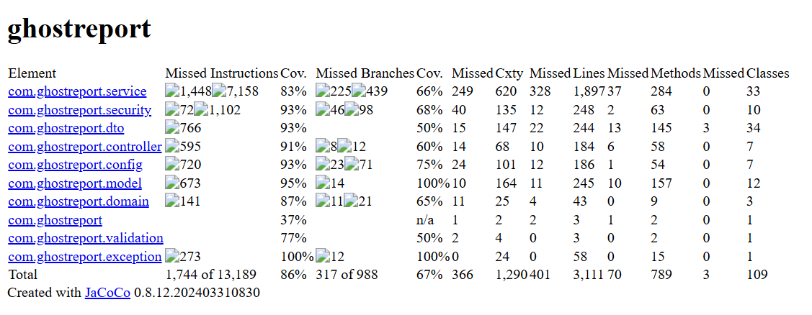
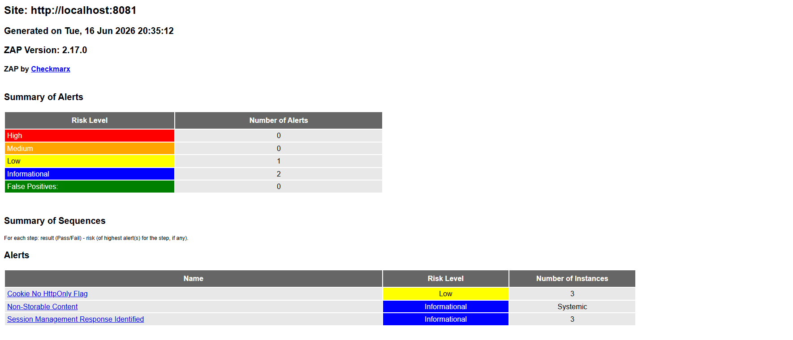

# Testes de seguranca e validacao

## 1. Resultado local

Comando executado na linha actual:

```powershell
cd ghostreport
.\mvnw.cmd test
```

Resultado confirmado em 2026-06-16: 299 testes, 0 falhas, 0 erros, 0 skipped.

### Evidencia visual JaCoCo

O relatório JaCoCo é gerado pela build Maven e pela pipeline como artefacto de cobertura. O screenshot seguinte é um apoio visual ao resumo de cobertura, não substituindo o relatório HTML gerado em `target/site/jacoco/`.



## 2. Estrategia

Os testes do GhostReport foram organizados para validar nao so "happy paths",
mas tambem abuso, autorizacao negativa, erros genericos, integridade e limites
operacionais. Isto segue a linha da Phase 1: cada ameaca STRIDE deve ter pelo
menos uma mitigacao implementada e, sempre que possivel, um teste que a prove.

## 3. Categorias de testes

| Categoria | Testes/classes | O que validam |
| --- | --- | --- |
| Contexto/config | `GhostreportApplicationTests`, `SecurityConfigurationValidatorTest`, `DataInitializerDisabledTest`, `SchemaMigrationScriptTest` | Arranque, secrets fracos, seed users, schema metadata, TLS/proxy/PostgreSQL TLS e limites de recursos prod-like. |
| Autenticacao/MFA/JWT | `AdminMfaAuthenticationTest`, `AuthenticationSecurityIntegrationTest`, `JwtServiceSecurityTest`, `JwtRevocationPersistenceIntegrationTest` | Password login, MFA para roles internas, token claims, revogacao, expiracao, kid, issuer/audience e bloqueio de challenge apos tentativas MFA invalidas. |
| Password reset/policy | `PasswordPolicyAndResetSecurityTest`, `PasswordPolicyServiceTest` | Password comprometida, reutilizacao, comprimento, ausencia de composicao obrigatoria, palavras contextuais e token expirado/reutilizado. |
| RBAC | `RbacAuthorizationMatrixTest`, `AdminAuthorizationTest`, `AuditorAuthorizationTest` | Endpoints permitidos/negados por role. |
| Admin lifecycle | `AdminUserManagementSecurityTest` | Activar/desactivar, editar roles, ultimo admin activo, audit logs. |
| Analyst ownership | `AnalystCaseOwnershipTest`, `BusinessLogicWorkflowSecurityTest` | Ownership, casos de outro analista, transitions, optimistic locking. |
| Public reports | `PublicReportFlowIntegrationTest`, `TrackingCodeEnumerationTest`, `RateLimiterServiceTest` | Criacao anonima, tracking code, erros seguros, minimizacao de anexos no tracking publico, enumeracao e rate limit de submissao. |
| Uploads/files | `ReportControllerAttachmentUploadTest`, `FileStorageServiceTest`, `SafeFilenameSecurityTest`, `SafeFilenameTest` | MIME, magic bytes, traversal, malware/quarantine, limites, paths. |
| Auditoria/logging | `AuditLogSecurityTest`, `AnonymousDataLoggingTest`, `RuntimeSecurityEventLoggingTest` | Nao guardar passwords/tokens/tracking code, alertas e correlationId. |
| Backups/packages | `BackupServiceIntegrationTest`, `AdminBackupControllerSecurityTest`, `CasePackageServiceIntegrationTest` | Manifestos, tampering, restore com reautenticacao, traversal, packages e respostas sem paths internos. |
| Frontend | `FrontendXssDataExposureTest`, `FrontendNavbarVisibilityTest`, `CsrfCookieAttributesTest` | DOM clobbering, XSS sinks, scripts inline, JWT apenas em `sessionStorage` durante a sessao do browser, ausencia de `localStorage`, tracking code em URL, categorias compativeis com o backend, tracking publico sem metadados de anexos, navs escondidas, CSRF cookie. |
| Headers/erros | `SecurityHeadersTest`, `SecurityMonitoringServiceTest`, `ErrorHandlingSecurityTest`, `ApiValidationContractTest` | CSP/HSTS/COOP/COEP/CORP, CSP report endpoint, Fetch Metadata, headers anormais, metadata `.git`/`.svn`, JSON errors genericos, validacao de contratos e alerta sanitizado. |
| Criptografia/arquitectura sensivel | `CryptographicInventoryTest`, `DangerousFunctionalityInventoryTest`, `ResponseDataMinimizationTest`, `JwtServiceSecurityTest`, `TrackingCodeTest`, `BackupServiceIntegrationTest` | Inventario criptografico, dangerous functionality, minimizacao de respostas, algoritmos aprovados, ausencia de algoritmos obsoletos, JWT HMAC, SecureRandom e integridade de backups. |
| Rate limiting | `RateLimiterServiceTest`, `LoginRateLimitSecurityTest` | Limites, reset de janela, brute force alert. |

## 4. Matriz de validacao de endpoints

| Fluxo | Validacoes | Testes |
| --- | --- | --- |
| `/auth/login` | Campos obrigatorios, rate limit, inactive user, erros genericos. | `AuthenticationSecurityIntegrationTest`, `LoginRateLimitSecurityTest`. |
| `/auth/mfa/verify` | Challenge obrigatorio, codigo de 6 digitos, TTL, uso unico, limite de tentativas invalidas e role activa. | `AdminMfaAuthenticationTest`. |
| `/auth/password-reset/*` | Resposta generica, token expirado/reutilizado, password policy. | `PasswordPolicyAndResetSecurityTest`. |
| `/reports` | Titulo/descricao/categoria, DTO, resposta sem hash interno. | `PublicReportFlowIntegrationTest`, `ApiValidationContractTest`. |
| `/reports` abuse | Rate limit especifico para submissao publica anonima. | `RateLimiterServiceTest`. |
| `/reports/verify` | Tracking code format, erro seguro, rate limit/enumeracao. | `TrackingCodeEnumerationTest`, `PublicReportFlowIntegrationTest`. |
| `/reports/{id}/attachments` | Max files, size, MIME, magic bytes, filename, tracking code. | `ReportControllerAttachmentUploadTest`, `FileStorageServiceTest`. |
| `/analyst/**` | Role, ownership, workflow, status/priority/notes. | `RbacAuthorizationMatrixTest`, `AnalystCaseOwnershipTest`, `BusinessLogicWorkflowSecurityTest`. |
| `/audit/**` | Auditor/admin read-only, sem paths/filenames sensiveis. | `AuditorAuthorizationTest`. |
| `/admin/users/**` | Role allowlist, password policy, ultimo admin activo. | `AdminUserManagementSecurityTest`. |
| `/admin/backups/**` | Admin-only, path traversal, verify before restore, reautenticacao para restore e resposta sem path interno. | `AdminBackupControllerSecurityTest`, `BackupServiceIntegrationTest`. |
| `/security/csp-report` | Recepcao publica/sem CSRF de CSP reports, resposta generica e alerta sanitizado sem JWT/tracking code. | `SecurityHeadersTest`, `SecurityMonitoringServiceTest`. |

## 5. STRIDE e testes

| STRIDE | Testes associados |
| --- | --- |
| Spoofing | `AdminMfaAuthenticationTest`, `JwtServiceSecurityTest`, `LoginRateLimitSecurityTest`. |
| Tampering | `BackupServiceIntegrationTest`, `CasePackageServiceIntegrationTest`, `JwtServiceSecurityTest`. |
| Repudiation | `AuditLogSecurityTest`, `RuntimeSecurityEventLoggingTest`. |
| Information Disclosure | `AnonymousDataLoggingTest`, `FrontendXssDataExposureTest`, `ErrorHandlingSecurityTest`. |
| Denial of Service | `RateLimiterServiceTest`, upload size/max files/quota tests. |
| Elevation of Privilege | `RbacAuthorizationMatrixTest`, `AnalystCaseOwnershipTest`, `AdminUserManagementSecurityTest`. |

## 6. Testes frontend

O frontend e estatico, mas tambem foi validado:

- nao usa `innerHTML`/sinks perigosos para dados externos;
- renderiza dados atraves de text nodes/helpers;
- nao usa scripts inline nem event handlers inline;
- guarda o JWT apenas em `sessionStorage` durante a sessao do browser no
  frontend academico, limpa-o no logout e nao usa `localStorage`;
- nao coloca tracking code em URLs;
- navs autenticadas começam escondidas;
- MFA existe em admin, analyst e auditor.

## 6.1 Testes de configuracao prod-like

`SecurityConfigurationValidatorTest` cobre explicitamente:

- rejeicao de secrets dev/test em perfis prod-like;
- rejeicao de seed users fora de dev/test;
- modo TLS obrigatorio (`direct` ou `reverse-proxy`);
- `direct` com `server.ssl.enabled=true`, keystore e apenas TLS 1.2/1.3;
- `reverse-proxy` com `server.forward-headers-strategy` e trusted proxy;
- PostgreSQL apenas com `sslmode=verify-ca` ou `sslmode=verify-full`;
- limites positivos para Hikari pool e Tomcat conexoes/threads/backlog.

## 6.2 Testes ASVS adicionais

A revisao ASVS final adicionou evidencias directas para:

- quota acumulada de anexos por denuncia em
  `ReportControllerAttachmentUploadTest`;
- rejeicao de HTTP parameter pollution por parametros escalares duplicados em
  `SecurityHeadersTest`;
- rejeicao de headers connection-specific em pedidos HTTP/2/HTTP/3 em
  `SecurityHeadersTest`;
- fallback de browser sem features de seguranca/runtime esperadas em
  `FrontendXssDataExposureTest`;
- password policy sem requisitos de composicao de caracteres, mas mantendo
  comprimento, denylist, contexto e historico em `PasswordPolicyServiceTest`;
- bloqueio explicito de paths `/.git` e `/.svn` em `SecurityHeadersTest`;
- inventario criptografico e deteccao estatica em `CryptographicInventoryTest`;
- reset de password iniciado por admin sem escolha de nova password em
  `AdminUserManagementSecurityTest`;
- ausencia de padroes de DOM clobbering em `FrontendXssDataExposureTest`;
- reautenticacao obrigatoria para restore de backup admin em
  `AdminBackupControllerSecurityTest`;
- minimizacao de respostas para nao expor paths internos de restore/packages em
  `ResponseDataMinimizationTest`;
- inventario de dangerous functionality em `DangerousFunctionalityInventoryTest`;
- geracao de 2.000 tracking codes com `SecureRandom` sem colisoes em
  `TrackingCodeTest`.

## 7. Testes de seguranca runtime/pipeline

Na pipeline, alem de `./mvnw verify`, existe job `dast-scan` que depende do `artifact-scan`:

- corre testes runtime seleccionados;
- descarrega a imagem Docker `ghostreport:ci` que passou pelo gate critico Trivy;
- arranca a aplicacao em container em `localhost:8081`;
- faz probes HTTP;
- verifica logs para fuga de dados sensiveis;
- corre ZAP baseline;
- publica evidencia runtime/IAST-like e DAST baseline.

Validacao local do probe expandido, executado contra a aplicacao em
`http://localhost:8081` com perfil `test` e MFA activo para demonstracao:

| Metrica | Resultado |
| --- | --- |
| Total de probes runtime | 101 |
| Passed | 101 |
| Failed | 0 |
| Skipped | 0 |
| Probes publicos | 23 |
| Probes admin | 22 |
| Probes analyst | 17 |
| Probes auditor | 13 |
| Casos negativos | 6 |

Nao houve probes skipped na execucao local validada. `GET /login.html` e
tratado como controlo de exposicao: `401/404` confirma que nao existe pagina
publica separada de login. O restore destrutivo de backup continua fora do
probe runtime; a evidencia executa validacao segura de filename/path traversal,
e os testes automatizados cobrem restore para staging com reautenticacao do
admin.

Artefactos relacionados:

- [iast-runtime-evidence.md](iast-runtime-evidence.md)
- [runtime-endpoints.md](runtime-endpoints.md)
- [runtime-log-sanitization.md](runtime-log-sanitization.md)

O reforco runtime inclui paginas publicas, `POST /reports`, tracking code,
upload/list/download de anexos, login/MFA/logout/password reset, endpoints
`/admin/**`, `/analyst/**`, `/audit/**` e casos negativos para metodo errado,
JSON malformado, content type errado, Authorization malformado, JWT invalido,
role errada e token ausente.

## 7.1 Triagem ZAP baseline

O screenshot seguinte resume uma execução do ZAP baseline contra `http://localhost:8081`. A triagem textual abaixo continua a ser a fonte principal para a decisão de aceitar/corrigir findings.



| Finding | Estado | Justificacao |
| --- | --- | --- |
| `CSP: Notices` | Corrigido por teste de headers | `SecurityHeadersTest` confirma CSP com `report-to csp-endpoint`, header `Report-To`, ausencia de `report-uri`, `unsafe-inline` e `unsafe-eval`. |
| `Cookie No HttpOnly Flag` em `XSRF-TOKEN` | Aceite tecnicamente | `CsrfCookieAttributesTest` confirma que o cookie e legivel pelo frontend, tem `SameSite=Lax`, nao contem JWT/bearer token e nao ha `JSESSIONID`. |
| `Non-Storable Content` | Aceite informacional | O `no-store` e intencional em respostas sensiveis para reduzir exposicao em cache. |
| `Session Management Response Identified` em `XSRF-TOKEN` | Aceite informacional | `XSRF-TOKEN` e token CSRF, nao token de autenticacao nem sessao. |

## 8. Limitacoes

- Testes automatizados nao substituem pentest manual.
- ZAP baseline e passivo e nao autenticado.
- IAST e evidencia runtime/IAST-like, nao agent-based.
- Rate limiting e em memoria; ambiente multi-no exigiria mecanismo externo.
- Certificado publico TLS, OCSP/ECH, secret manager e SIEM/WORM continuam
  controlos operacionais fora dos testes automatizados.
