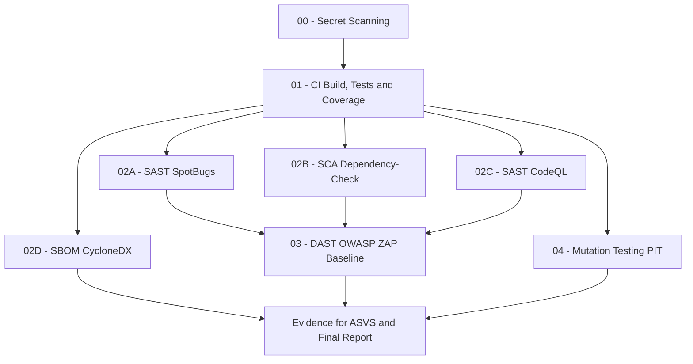

# DevSecOps Pipeline Flow

This document explains the intended validation flow for GhostReport in Phase 2
Sprint 2. The workflows are kept separate for clarity and faster feedback, but
they are documented as one coherent DevSecOps process.

## Flow Overview

## Stage 00 - Secret Scanning

Workflow: `.github/workflows/secret-scan-gitleaks.yml`

Purpose:

- scan the repository for hardcoded secrets;
- produce a JSON report;
- provide early feedback before deeper validation.

Recommended interpretation:

- a confirmed secret finding should be treated as blocking;
- an empty JSON array is valid evidence that no secrets were found in the
  scanned repository content.

## Stage 01 - CI Build, Tests and Coverage

Workflow: `.github/workflows/ci-tests.yml`

Purpose:

- compile the Spring Boot application;
- run automated tests;
- generate JaCoCo coverage evidence;
- enforce conservative JaCoCo baseline thresholds;
- use PostgreSQL 16 as a service container.

Recommended interpretation:

- this is the main blocking quality gate;
- later SAST, SCA and DAST evidence is only meaningful if the application can
  build and the automated test suite passes.

## Stage 02A - SAST SpotBugs

Workflow: `.github/workflows/sast-spotbugs.yml`

Purpose:

- run static analysis on Java code;
- identify suspicious patterns, bad practices and hardening opportunities;
- publish an XML artifact for manual triage.

Recommended interpretation:

- Sprint 2 mode is evidence/manual triage;
- findings should be fixed, documented as accepted risk, or justified as
  framework-managed behavior.

## Stage 02B - SCA OWASP Dependency-Check

Workflow: `.github/workflows/sca-dependency-check.yml`

Purpose:

- identify known vulnerabilities in dependencies;
- generate HTML, JSON, XML and SARIF reports;
- support dependency risk triage.

Recommended interpretation:

- Sprint 2 mode is evidence/manual triage;
- the build is not failed automatically while the team validates CVEs and false
  positives;
- `NVD_API_KEY` is provided through GitHub Actions secrets.

## Stage 02C - SAST CodeQL

Workflow: `.github/workflows/sast-codeql.yml`

Purpose:

- run semantic code analysis for Java;
- complement SpotBugs with GitHub Code Scanning alerts;
- identify vulnerability patterns that pure bytecode/static bug rules may miss.

Recommended interpretation:

- Sprint 2 mode is evidence/manual triage;
- CodeQL alerts should be reviewed together with SpotBugs findings.

## Stage 02D - SBOM CycloneDX

Workflow: `.github/workflows/sbom-cyclonedx.yml`

Purpose:

- generate a CycloneDX software bill of materials;
- provide supply-chain evidence for dependency inventory and SCA review.

Recommended interpretation:

- the SBOM is evidence for ASVS/dependency management;
- the SBOM does not replace vulnerability triage.

## Stage 03 - DAST OWASP ZAP Baseline

Workflow: `.github/workflows/dast-zap.yml`

Purpose:

- start GhostReport on the GitHub runner at `http://localhost:8081`;
- run OWASP ZAP in Docker with host networking;
- generate baseline/passive DAST reports.

Recommended interpretation:

- DAST is runtime evidence;
- the scan is unauthenticated, passive and non-intrusive;
- warnings are triaged manually;
- authenticated DAST and active scans are future work.

## Stage 04 - Mutation Testing PIT

Workflow: `.github/workflows/mutation-pit.yml`

Purpose:

- measure test strength beyond line coverage;
- identify code paths where tests execute lines but do not detect behavioral changes.

Recommended interpretation:

- Sprint 2 mode is evidence/manual triage;
- mutation score should guide future test improvements, not block every build yet.

## Blocking vs Evidence Mode

| Stage | Blocking? | Reason |
| --- | --- | --- |
| Secret scanning | Yes for confirmed secrets | Secrets must not enter the repository. |
| CI build/tests | Yes | Broken builds or failing tests block delivery confidence. |
| JaCoCo | Yes for baseline threshold regressions | Coverage is measured, published and kept above conservative minimum thresholds. |
| SpotBugs | Evidence | Findings need manual triage during Sprint 2. |
| Dependency-Check | Evidence | CVEs require false-positive and applicability analysis. |
| CodeQL | Evidence | Semantic findings require manual review and may depend on context. |
| CycloneDX SBOM | Evidence | Inventory evidence supports SCA and ASVS but is not a vulnerability gate. |
| ZAP baseline | Evidence | Baseline warnings are hardening opportunities, not necessarily exploitable vulnerabilities. |
| PIT mutation testing | Evidence | Mutation score guides test quality improvement without blocking near delivery. |

## Why Workflows Are Separate

The workflows are separated to make each security activity easier to understand,
rerun and explain:

- fast feedback for secrets and CI;
- independent reruns for long SCA/DAST jobs;
- clearer artifacts per security activity;
- easier mapping to ASVS controls and report evidence.

This gives the project a professional DevSecOps flow without adding unnecessary
pipeline complexity before final delivery.
